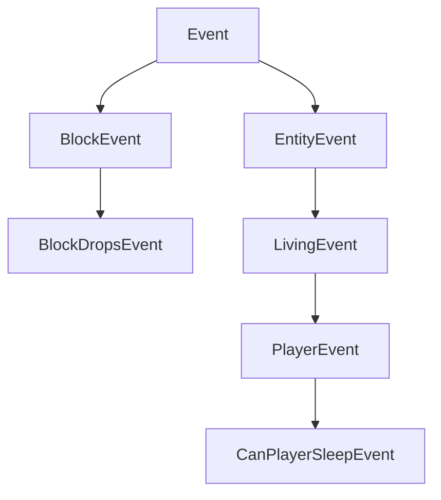

import Tabs from '@theme/Tabs';
import TabItem from '@theme/TabItem';

# 事件 {#events}

NeoForge 的主要特性之一是事件系统。游戏中发生的各种事情都会触发事件。例如，有玩家右键点击时的事件、玩家或其他实体跳跃时的事件、方块被渲染时的事件、游戏加载时的事件等等。Mod 开发者可以为这些事件中的每一个订阅事件处理器，然后在这些事件处理器内部执行他们期望的行为。

事件在它们各自的事件总线上触发。最重要的总线是 `NeoForge.EVENT_BUS`，也称为**游戏（game）**总线。除此之外，在启动期间，会为每个已加载的 Mod 生成一个 Mod 总线，并传入该 Mod 的构造函数。许多 Mod 总线事件是并行触发的（与总在同一线程上运行的主总线事件不同），这大大提升了启动速度。更多信息参见[下文][modbus]。

## 注册事件处理器 {#registering-an-event-handler}

注册事件处理器有多种方式。这些方式的共同点是：每个事件处理器都是一个只有单个事件参数、且没有返回结果（即返回类型为 `void`）的方法。

### `IEventBus#addListener` {#ieventbusaddlistener}

注册方法处理器最简单的方式是注册它们的方法引用，如下所示：

```java
@Mod("yourmodid")
public class YourMod {
    public YourMod(IEventBus modBus) {
        NeoForge.EVENT_BUS.addListener(YourMod::onLivingJump);
    }

    // Heals an entity by half a heart every time they jump.
    private static void onLivingJump(LivingEvent.LivingJumpEvent event) {
        LivingEntity entity = event.getEntity();
        // Only heal on the server side
        if (!entity.level().isClientSide()) {
            entity.heal(1);
        }
    }
}
```

### `@SubscribeEvent` {#subscribeevent}

或者，事件处理器也可以由注解驱动：创建一个事件处理器方法并为其加上 `@SubscribeEvent` 注解。然后，你可以把包含该方法的类的一个实例传给事件总线，从而注册该实例上所有带 `@SubscribeEvent` 注解的事件处理器：

```java
public class EventHandler {
    @SubscribeEvent
    public void onLivingJump(LivingEvent.LivingJumpEvent event) {
        LivingEntity entity = event.getEntity();
        if (!entity.level().isClientSide()) {
            entity.heal(1);
        }
    }
}

@Mod("yourmodid")
public class YourMod {
    public YourMod(IEventBus modBus) {
        NeoForge.EVENT_BUS.register(new EventHandler());
    }
}
```

你也可以以静态方式来做。只需把所有事件处理器设为 static，并传入类本身而非类实例：

```java
public class EventHandler {
	@SubscribeEvent
    public static void onLivingJump(LivingEvent.LivingJumpEvent event) {
        LivingEntity entity = event.getEntity();
        if (!entity.level().isClientSide()) {
            entity.heal(1);
        }
    }
}

@Mod("yourmodid")
public class YourMod {
    public YourMod(IEventBus modBus) {
        NeoForge.EVENT_BUS.register(EventHandler.class);
    }
}
```

### `@EventBusSubscriber` {#eventbussubscriber}

我们还可以更进一步，同时给事件处理器类加上 `@EventBusSubscriber` 注解。这个注解会被 NeoForge 自动发现，从而让你能够把所有与事件相关的代码从 Mod 构造函数中移除。本质上，它等价于在 Mod 构造函数末尾调用 `NeoForge.EVENT_BUS.register(EventHandler.class)` 和 `modBus.register(EventHandler.class)`。这也意味着所有处理器同样必须是 static 的。

虽然并非必需，但强烈推荐在注解中指定 `modid` 参数，以便让调试更容易（尤其是在涉及 Mod 冲突时）。

```java
@EventBusSubscriber(modid = "yourmodid")
public class EventHandler {
    @SubscribeEvent
    public static void onLivingJump(LivingEvent.LivingJumpEvent event) {
        LivingEntity entity = event.getEntity();
        if (!entity.level().isClientSide()) {
            entity.heal(1);
        }
    }
}
```

## 事件的各种选项 {#event-options}

### 字段与方法 {#fields-and-methods}

字段和方法大概是一个事件最显而易见的部分。大多数事件都包含供事件处理器使用的上下文，例如引发该事件的实体，或该事件发生所在的 level。

### 层级结构 {#hierarchy}

为了利用继承带来的优势，一些事件并不直接扩展 `Event`，而是扩展它的某个子类，例如 `BlockEvent`（为与方块相关的事件包含方块上下文）或 `EntityEvent`（类似地包含实体上下文），以及后者的子类 `LivingEvent`（用于 `LivingEntity` 专属上下文）和 `PlayerEvent`（用于 `Player` 专属上下文）。这些提供上下文的父级事件是 `abstract` 的，无法被监听。

:::danger
如果你监听一个 `abstract` 事件，你的游戏将会崩溃，因为这绝不会是你想要的结果。你应当始终监听它的某个子事件。
:::



### 可取消的事件 {#cancellable-events}

一些事件实现了 `ICancellableEvent` 接口。这些事件可以使用 `#setCanceled(boolean canceled)` 取消，且可以使用 `#isCanceled()` 检查其取消状态。如果一个事件被取消，该事件的其他事件处理器将不再运行，同时会启用某种与“取消”相关联的行为。例如，取消 `LivingChangeTargetEvent` 将阻止该实体的目标实体发生改变。

事件处理器可以选择显式地接收已取消的事件。这通过把 `IEventBus#addListener`（或 `@SubscribeEvent`，取决于你附加事件处理器的方式）中的 `receiveCanceled` 布尔参数设为 true 来实现。

### TriState 与 Result {#tristates-and-results}

一些事件有三种可能的返回状态，由 `TriState` 表示，或直接在事件类上以 `Result` 枚举表示。这些返回状态通常可以取消该事件正在处理的动作（`TriState#FALSE`）、强制该动作运行（`TriState#TRUE`），或执行默认的原版行为（`TriState#DEFAULT`）。

一个拥有三种可能返回状态的事件会有某个 `set*` 方法，用来设置期望的结果。

```java
// In some event handler class

@SubscribeEvent // on the game event bus
public static void renderNameTag(RenderNameTagEvent.CanRender event) {
    // Uses TriState to set the return state
    event.setCanRender(TriState.FALSE);
}

@SubscribeEvent // on the game event bus
public static void mobDespawn(MobDespawnEvent event) {
    // Uses a Result enum to set the return state
    event.setResult(MobDespawnEvent.Result.DENY);
}
```

### 优先级 {#priority}

事件处理器可以选择性地被指定一个优先级。`EventPriority` 枚举包含五个值：`HIGHEST`、`HIGH`、`NORMAL`（默认）、`LOW` 和 `LOWEST`。事件处理器按从最高到最低的优先级执行。如果它们优先级相同，则在主总线上按注册顺序触发（这大致与 Mod 加载顺序相关），在 Mod 总线上则按确切的 Mod 加载顺序触发（见下文）。

优先级可以通过设置 `IEventBus#addListener` 或 `@SubscribeEvent` 中的 `priority` 参数来定义，取决于你附加事件处理器的方式。注意，对于并行触发的事件，优先级会被忽略。

### 分端事件 {#sided-events}

一些事件只在某一[端][side]触发。常见的例子包括各种渲染事件，它们只在客户端触发。由于纯客户端事件通常需要访问 Minecraft 代码库中其他纯客户端的部分，因此它们需要相应地注册。

使用 `IEventBus#addListener` 的事件处理器应当通过 `FMLEnvironment#getDist` 或主 Mod 构造函数中的 `Dist` 参数检查当前的物理端，并像[端][side]相关文章中所述那样，在一个单独的纯客户端类中添加监听器。

使用 `@EventBusSubscriber` 的事件处理器可以把端指定为注解的 `value` 参数，例如 `@EventBusSubscriber(value = Dist.CLIENT, modid = "yourmodid")`。

## 事件总线 {#event-buses}

虽然大多数事件都发布在 `NeoForge.EVENT_BUS` 上，但一些事件改为发布在 Mod 事件总线上。这些通常被称为 Mod 总线事件。Mod 总线事件可以通过它们的超接口 `IModBusEvent` 与常规事件区分开来。

Mod 事件总线会作为参数在 Mod 构造函数中传给你，然后你就可以向它订阅 Mod 总线事件。如果你使用 `@EventBusSubscriber`，事件会被自动订阅到正确的总线上。

### Mod 生命周期 {#the-mod-lifecycle}

大多数 Mod 总线事件是所谓的生命周期事件。生命周期事件在每个 Mod 的生命周期中于启动期间运行一次。它们中的许多通过继承 `ParallelDispatchEvent` 而并行触发；如果你想在主线程上运行来自这些事件之一的代码，请使用 `#enqueueWork(Runnable runnable)` 将其入队。

生命周期大体遵循以下顺序：

- 调用 Mod 构造函数。在这里，或在下一步中注册你的事件处理器。
- 调用所有 `@EventBusSubscriber`。
- 触发 `FMLConstructModEvent`。
- 触发注册事件，其中包括 [`NewRegistryEvent`][newregistry]、[`DataPackRegistryEvent.NewRegistry`][newdatapackregistry]，以及为每个注册表触发的 [`RegisterEvent`][registerevent]。
- 触发 `FMLCommonSetupEvent`。这是各种杂项设置发生的地方。
- 触发[分端][side]设置：在物理客户端上触发 `FMLClientSetupEvent`，在物理服务端上触发 `FMLDedicatedServerSetupEvent`。
- 处理 `InterModComms`（见下文）。
- 触发 `FMLLoadCompleteEvent`。

#### `InterModComms` {#intermodcomms}

`InterModComms` 是一个允许 Mod 开发者向其他 Mod 发送消息以实现兼容功能的系统。该类为各个 Mod 保存消息，所有方法调用都是线程安全的。该系统主要由两个事件驱动：`InterModEnqueueEvent` 和 `InterModProcessEvent`。

在 `InterModEnqueueEvent` 期间，你可以使用 `InterModComms#sendTo` 向其他 Mod 发送消息。这些方法接受要将消息发送到的 Mod 的 id、与消息数据关联的键（用于区分不同的消息），以及一个持有消息数据的 `Supplier`。发送方也可以选择性地指定。

然后，在 `InterModProcessEvent` 期间，你可以使用 `InterModComms#getMessages` 获取所有已接收消息的流，形式为 `IMCMessage` 对象。它们持有数据的发送方、数据的预期接收方、数据键，以及实际数据的 supplier。

### 其他 Mod 总线事件 {#other-mod-bus-events}

除了生命周期事件之外，还有少数杂项事件在 Mod 事件总线上触发，大多出于历史遗留原因。这些通常是你可以用来注册、设置或初始化各种东西的事件。与生命周期事件不同，这些事件中的大多数不会并行运行。举几个例子：

- `RegisterColorHandlersEvent.BlockTintSources`、`.ItemTintSources`、`.ColorResolvers` 
- `ModelEvent.BakingCompleted`
- `TextureAtlasStitchedEvent`

:::warning
这些事件中的大多数计划在未来某个版本中移到游戏事件总线上。
:::

[modbus]: #event-buses
[newdatapackregistry]: registries.md#custom-datapack-registries
[newregistry]: registries.md#custom-registries
[registerevent]: registries.md#registerevent
[side]: sides.md
