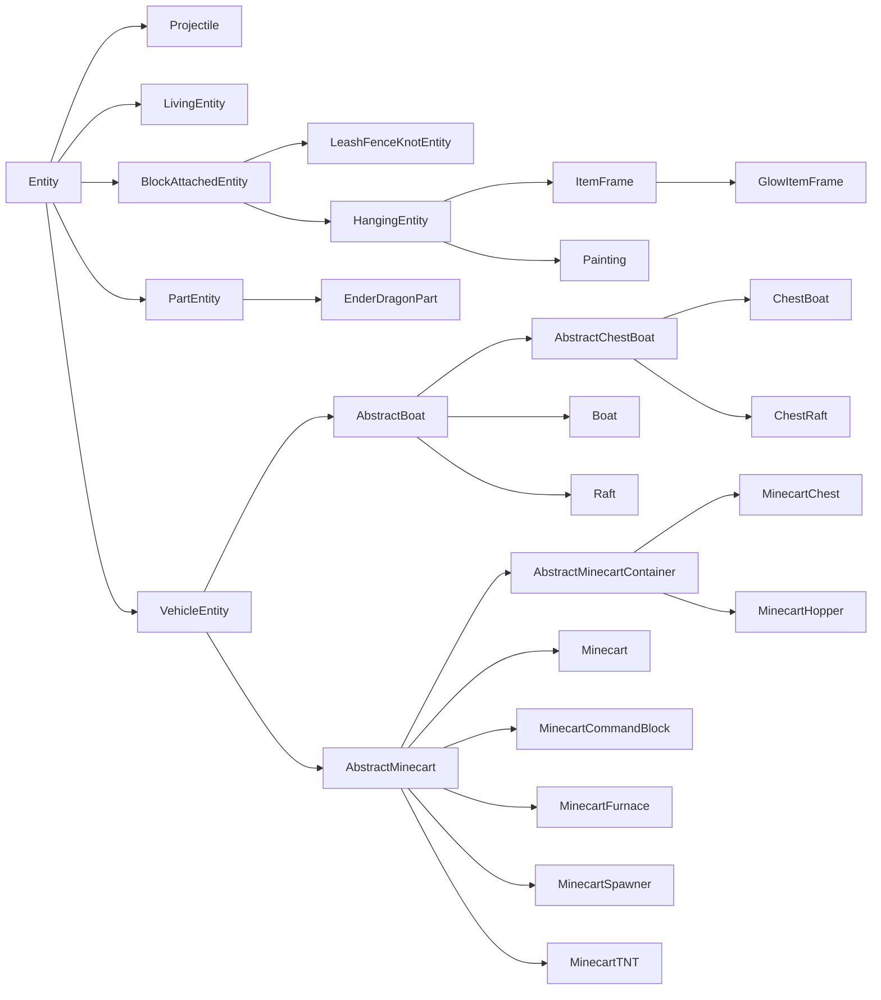
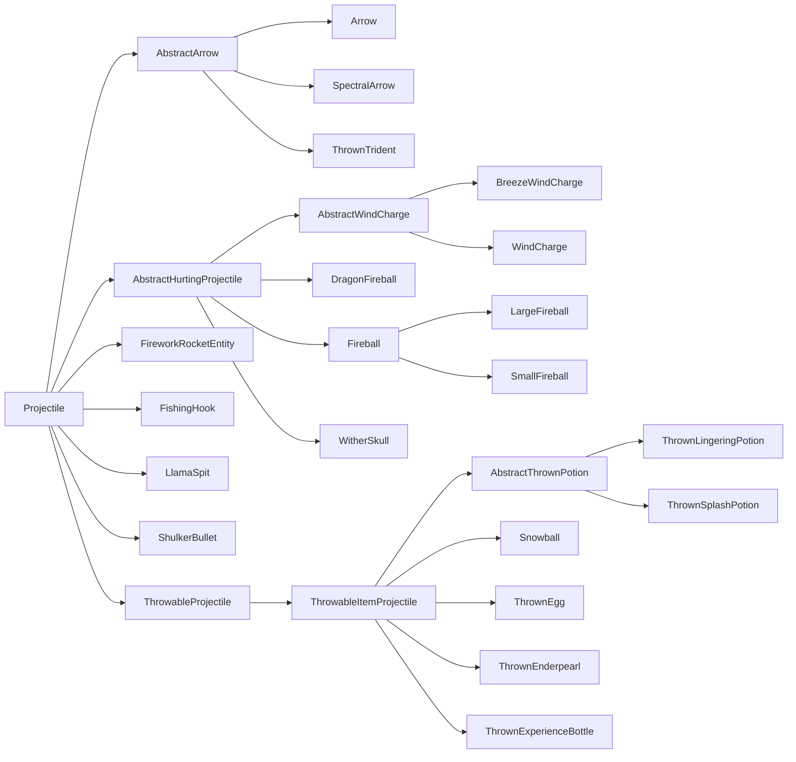

# 实体 {#entities}

实体是世界中的对象，能够以多种方式与世界交互。常见的例子包括生物、抛射物、可骑乘对象，甚至玩家。每个实体都由多个系统组成，乍看之下可能并不容易理解。本节将拆解构造实体、并让它按 Mod 开发者意图行事所涉及的一些关键组件。

## 术语 {#terminology}

一个简单的实体由三部分组成：

- [`Entity`][entity] 子类，承载实体的大部分逻辑；
- [`EntityType`][type]，它被[注册][registration]，并持有一些通用属性；以及
- [`EntityRenderer`][renderer]，负责在游戏中显示该实体。

更复杂的实体可能需要更多部分。例如，许多较复杂的 `EntityRenderer` 会使用底层的 `EntityModel` 实例。又如，一个能够自然生成的实体会需要某种[生成机制][spawning]。

## `EntityType` {#entitytype}

`EntityType` 与 `Entity` 之间的关系，类似于 [`Item`][item] 与 [`ItemStack`][itemstack] 之间的关系。与 `Item` 一样，`EntityType` 是单例，被注册到对应的注册表（实体类型注册表）中，并持有该类型所有实体共有的一些值；而 `Entity` 就像 `ItemStack` 一样，是该单例类型的“实例”，持有专属于某个实体实例的数据。不过，这里的关键区别在于：大部分行为并不定义在单例 `EntityType` 中，而是定义在实例化的 `Entity` 类本身。

下面创建 `EntityType` 注册表并为其注册一个 `EntityType`，假设我们有一个继承 `Entity` 的类 `MyEntity`（更多信息见[下文][entity]）。`EntityType.Builder` 上的所有方法，除了末尾的 `#build` 调用之外，都是可选的。

```java
public static final DeferredRegister.Entities ENTITY_TYPES =
    DeferredRegister.createEntities(ExampleMod.MOD_ID);

public static final Supplier<EntityType<MyEntity>> MY_ENTITY = ENTITY_TYPES.register(
    "my_entity",
    // The entity type, created using a builder.
    () -> EntityType.Builder.of(
        // An EntityType.EntityFactory<T>, where T is the entity class used - MyEntity in this case.
        // You can think of it as a BiFunction<EntityType<T>, Level, T>.
        // This is commonly a reference to the entity constructor.
        MyEntity::new,
        // The MobCategory our entity uses. This is mainly relevant for spawning.
        // See below for more information.
        MobCategory.MISC
    )
    // The width and height, in blocks. The width is used in both horizontal directions.
    // This also means that non-square footprints are not supported. Default is 0.6f and 1.8f.
    .sized(1.0f, 1.0f)
    // A multiplicative factor (scalar) used by mobs that spawn in varying sizes.
    // In vanilla, these are only slimes and magma cubes, both of which use 4.0f.
    .spawnDimensionsScale(4.0f)
    // The eye height, in blocks from the bottom of the size. Defaults to height * 0.85.
    // This must be called after #sized to have an effect.
    .eyeHeight(0.5f)
    // Disables the entity being summonable via /summon.
    .noSummon()
    // Prevents the entity from being saved to disk.
    .noSave()
    // Makes the entity fire immune.
    .fireImmune()
    // Makes the entity immune to damage from a certain block. Vanilla uses this to make
    // foxes immune to sweet berry bushes, withers and wither skeletons immune to wither roses,
    // and polar bears, snow golems and strays immune to powder snow.
    .immuneTo(Blocks.POWDER_SNOW)
    // Disables a rule in the spawn handler that limits the distance at which entities can spawn.
    // This means that no matter the distance to the player, this entity can spawn.
    // Vanilla enables this for pillagers and shulkers.
    .canSpawnFarFromPlayer()
    // The range in which the entity is kept loaded by the client, in chunks.
    // Vanilla values for this vary, but it's often something around 8 or 10. Defaults to 5.
    // Be aware that if this is greater than the client's chunk view distance,
    // then that chunk view distance is effectively used here instead.
    .clientTrackingRange(8)
    // How often update packets are sent for this entity, in once every x ticks. This is set to higher values
    // for entities that have predictable movement patterns, for example projectiles. Defaults to 3.
    .updateInterval(10)
    // Build the entity type using a resource key. The second parameter should be the same as the entity id.
    .build(ResourceKey.create(
        Registries.ENTITY_TYPE,
        Identifier.fromNamespaceAndPath("examplemod", "my_entity")
    ))
);

// Shorthand version to avoid boilerplate. The following call is the same as
// ENTITY_TYPES.register("my_entity", () -> EntityType.Builder.of(MyEntity::new, MobCategory.MISC).build(
//     ResourceKey.create(Registries.ENTITY_TYPE, Identifier.fromNamespaceAndPath("examplemod", "my_entity"))
// );
public static final Supplier<EntityType<MyEntity>> MY_ENTITY =
    ENTITY_TYPES.registerEntityType("my_entity", MyEntity::new, MobCategory.MISC);

// Shorthand version that still allows calling additional builder methods
// by supplying a UnaryOperator<EntityType.Builder> parameter.
public static final Supplier<EntityType<MyEntity>> MY_ENTITY = ENTITY_TYPES.registerEntityType(
    "my_entity", MyEntity::new, MobCategory.MISC,
    builder -> builder.sized(2.0f, 2.0f).eyeHeight(1.5f).updateInterval(5));
```

### `MobCategory` {#mobcategory}

_另见[自然生成][mobspawn]。_

实体的 `MobCategory` 决定了它的一些属性，这些属性与[生成与消失][mobspawn]相关。原版默认共添加了八种 `MobCategory`：

| 名称                         | 生成上限  | 示例                                                                                                                       |
|------------------------------|-----------|--------------------------------------------------------------------------------------------------------------------------------|
| `MONSTER`                    | 70        | 各种怪物                                                                                                               |
| `CREATURE`                   | 10        | 各种动物                                                                                                                |
| `AMBIENT`                    | 15        | 蝙蝠                                                                                                                           |
| `AXOLOTS`                    | 5         | 美西螈                                                                                                                       |
| `UNDERGROUND_WATER_CREATURE` | 5         | 发光鱿鱼                                                                                                                    |
| `WATER_CREATURE`             | 5         | 鱿鱼、海豚                                                                                                               |
| `WATER_AMBIENT`              | 20        | 鱼类                                                                                                                           |
| `MISC`                       | 无        | 所有非生物实体，例如抛射物；使用这个 `MobCategory` 会使实体完全无法自然生成 |

还有一些属性，各自只在一两个 `MobCategory` 上设置：

- `isFriendly`：对 `MONSTER` 设为 false，对其余所有设为 true。
- `isPersistent`：对 `CREATURE` 和 `MISC` 设为 true，对其余所有设为 false。
- `despawnDistance`：对 `WATER_AMBIENT` 设为 64，对其余所有设为 128。

:::info
`MobCategory` 是一个[可扩展枚举][extenum]，也就是说你可以向其中添加自定义条目。若这么做，你还需要为这个自定义 `MobCategory` 的实体添加某种生成机制。
:::

## Entity 类 {#the-entity-class}

首先，我们创建一个 `Entity` 子类。除了构造函数外，`Entity`（它是一个抽象类）还定义了四个我们必须实现的必需方法。为免本文过于冗长，前三个方法将在[数据与网络通信一文][data]中讲解，`#hurtServer` 则在[对实体造成伤害一节][damaging]中讲解。

```java
public class MyEntity extends Entity {
    // We inherit this constructor without the bound on the generic wildcard.
    // The bound is needed for registration below, so we add it here.
    public MyEntity(EntityType<? extends MyEntity> type, Level level) {
        super(type, level);
    }

    // See the Data and Networking article for information about these methods.
    @Override
    protected void readAdditionalSaveData(ValueInput input) {}

    @Override
    protected void addAdditionalSaveData(ValueOutput output) {}

    @Override
    protected void defineSynchedData(SynchedEntityData.Builder builder) {}

    @Override
    public boolean hurtServer(ServerLevel level, DamageSource damageSource, float amount) {
        return true;
    }
}
```

:::info
虽然可以直接继承 `Entity`，但通常更合理的做法是改用它的众多子类之一作为基类。更多信息见[实体类层级结构][hierarchy]。
:::

如有需要（例如你要从代码中生成实体），也可以添加自定义构造函数。这些构造函数通常将实体类型硬编码为对已注册对象的引用，如下所示：

```java
public MyEntity(EntityType<? extends MyEntity> type, Level level, double x, double y, double z) {
    // Delegates to the factory constructor, using the EntityType we registered before.
    this(type, level);
    this.setPos(x, y, z);
}
```

:::warning
自定义构造函数绝不应恰好带两个参数，因为那会与上面的 `(EntityType, Level)` 构造函数产生混淆。
:::

现在，我们基本可以对实体为所欲为了。以下各小节将展示各种常见的实体用例。

### 实体上的数据存储 {#data-storage-on-entities}

_见[实体/数据与网络通信][data]。_

### 渲染实体 {#rendering-entities}

_见[实体/实体渲染器][renderer]。_

### 生成实体 {#spawning-entities}

如果现在启动游戏并进入一个世界，我们恰好只有一种生成方式：通过 [`/summon`][summon] 命令（前提是没有调用 `EntityType.Builder#noSummon`）。

显然，我们希望用别的方式来添加实体。最简单的方式是通过 `LevelWriter#addFreshEntity` 方法。该方法只需接收一个 `Entity` 实例并将其添加到世界中，如下所示：

```java
// In some method that has a level available, only on the server
if (!level.isClientSide()) {
    MyEntity entity = new MyEntity(level, 100.0, 200.0, 300.0);
    level.addFreshEntity(entity);
}
```

另外，你也可以调用 `EntityType#spawn`，在生成[生物实体][livingentity]时尤其推荐这样做，因为它会执行一些额外的初始化，例如触发生成[事件][event]。

几乎所有非生物实体都会使用这种方式。玩家显然不应由你自己生成，`Mob` 有[它们自己的生成方式][mobspawn]（不过它们也可以通过 `#addFreshEntity` 添加），原版[抛射物][projectile]也在 `Projectile` 类中提供了用于生成的静态辅助方法。

### 对实体造成伤害 {#damaging-entities}

_另见[左键点击物品][leftclick]。_

尽管并非所有实体都有生命值这一概念，但它们都仍可以受到伤害。这不仅用于生物和玩家这类对象：想想物品实体（掉落的物品），它们同样会受到火或仙人掌等来源的伤害，这种情况下它们通常会立即被删除。

对实体造成伤害可以通过调用 `Entity#hurt` 或 `Entity#hurtOrSimulate` 来实现，这两者的区别下文会说明。两个方法都接收两个参数：[`DamageSource`][damagesource] 和伤害量（以半颗心为单位的 float）。例如，调用 `entity.hurt(entity.damageSources().wither(), 4.25)` 会造成略多于两颗心的凋灵伤害。

反过来，实体也可以修改这一行为。这不是通过重写 `#hurt` 来完成的，因为它是 final 方法。相反，有两个方法 `#hurtServer` 和 `#hurtClient`，分别处理对应端的伤害逻辑。`#hurtClient` 常用于告诉客户端一次攻击已成功——即便这未必总是真的——主要是为了无论如何都播放攻击音效和其他效果。要改变伤害行为，我们主要关心 `#hurtServer`，可以像下面这样重写它：

```java
@Override
// The boolean return value determines whether the entity was actually damaged or not.
public boolean hurtServer(ServerLevel level, DamageSource damageSource, float amount) {
    if (damageSource.is(DamageTypeTags.IS_FIRE)) {
        // This assumes that super#hurtServer() is implemented. Common other ways to do this
        // are to set some field yourself. Vanilla implementations vary greatly across different entities.
        // Notably, living entities usually call #actuallyHurt, which in turn calls #setHealth.
        return super.hurtServer(level, damageSource, amount * 2);
    } else {
        return false;
    }
}
```

这种服务端/客户端的分离也正是 `Entity#hurt` 与 `Entity#hurtOrSimulate` 的区别：`Entity#hurt` 只在服务端运行（并调用 `Entity#hurtServer`），而 `Entity#hurtOrSimulate` 在两端都运行，根据所在端调用 `Entity#hurtServer` 或 `Entity#hurtClient`。

也可以通过事件来修改对不属于你的实体（即 Minecraft 或其他 Mod 添加的实体）造成的伤害。这些事件包含大量专属于 `LivingEntity` 的代码；因此，它们的文档位于[生物实体一文][livingentity]中的[伤害事件一节][damageevents]。

### 实体的 tick 处理 {#ticking-entities}

很多时候，你会希望实体每 tick 做点什么（例如移动）。这类逻辑分散在若干方法中：

- `#tick`：这是核心 tick 方法，99% 的情况下你都会想重写它。
    - 默认情况下，它会转发到 `#baseTick`，不过几乎每个子类都会重写它。
- `#baseTick`：该方法负责更新所有实体共有的一些值，包括“着火”状态、被细雪冻结、游泳状态以及穿过传送门。`LivingEntity` 还会在这里额外处理溺水、方块内伤害以及伤害追踪器的更新。如果你想改变或扩展这些逻辑，就重写该方法。
    - 默认情况下，`Entity#tick` 会转发到该方法。
- `#rideTick`：该方法会为其他实体的乘客调用，例如骑马的玩家，或者由于使用 `/ride` 命令而骑乘另一实体的任意实体。
    - 默认情况下，它会做一些检查，然后调用 `#tick`。骷髅和玩家重写了该方法，以对骑乘实体做特殊处理。

此外，实体有一个名为 `tickCount` 的字段，表示该实体存在于世界中的时间（以 tick 为单位），还有一个名为 `firstTick` 的布尔字段，其含义应当不言自明。例如，如果你想每 5 tick [生成一个粒子][particle]，可以使用以下代码：

```java
@Override
public void tick() {
    // Always call super unless you have a good reason not to.
    super.tick();
    // Run this code once every 5 ticks.
    if (this.tickCount % 5 == 0) {
        this.level().addParticle(...);
    }
}
```

### 拾取实体 {#picking-entities}

_另见[中键点击][middleclick]。_

拾取（Picking）是指选中玩家当前正看着的对象，并随之拾取关联物品的过程。中键点击的结果（即“拾取结果”）可由你的实体修改（注意 `Mob` 类会自动为你选择正确的刷怪蛋）：

```java
@Override
@Nullable
public ItemStack getPickResult() {
    // Assumes that MY_CUSTOM_ITEM is a DeferredItem<?>, see the Items article for more information.
    // If the entity should not be pickable, it is advised to return null here.
    return new ItemStack(MY_CUSTOM_ITEM.get());
}
```

尽管实体通常应可拾取，但在一些小众场景中这并不可取。原版的一个用例是末影龙，它由多个部分组成。父实体禁用了拾取，但各部分又重新启用了拾取，以便更精细地调校碰撞箱。

如果你也有类似的小众用例，你的实体也可以像下面这样完全禁用拾取：

```java
@Override
public boolean isPickable() {
    // Additional checks may be performed here if needed.
    return false;
}
```

如果你想自己执行拾取（即射线检测），可以在你想作为射线起点的实体上调用 `Entity#pick`。它会返回一个 [`HitResult`][hitresult]，你可以进一步检查射线检测究竟击中了什么。

### 实体挂点 {#entity-attachments}

_请勿与[数据附加数据][dataattachments]混淆。_

实体挂点（Entity Attachment）用于为实体定义可视化的挂载点。借助这一系统，可以定义诸如乘客或名称标签相对于实体自身显示的位置。实体本身只控制挂点的默认位置，随后挂点可以定义相对于该默认位置的偏移。

在构建 `EntityType` 时，可以通过调用 `EntityType.Builder#attach` 设置任意数量的挂载点。该方法接收一个 `EntityAttachment`（定义要处理的挂点）以及三个 float 用于定义位置（x/y/z）。该位置应相对于挂点默认值所在的位置来定义。

原版定义了以下四种 `EntityAttachment`：

| 名称           | 默认位置                                 | 用途                                                                 |
|----------------|------------------------------------------|----------------------------------------------------------------------|
| `PASSENGER`    | 碰撞箱的中心 X / 顶部 Y / 中心 Z         | 可骑乘实体（如马），用于定义乘客出现的位置                            |
| `VEHICLE`      | 碰撞箱的中心 X / 底部 Y / 中心 Z         | 所有实体，用于定义它们骑乘另一实体时出现的位置                        |
| `NAME_TAG`     | 碰撞箱的中心 X / 顶部 Y / 中心 Z         | 定义实体名称标签出现的位置（如适用）                                  |
| `WARDEN_CHEST` | 碰撞箱的中心 X / 中心 Y / 中心 Z         | 由监守者使用，用于定义音波攻击的发出位置                             |

:::info
`PASSENGER` 与 `VEHICLE` 之间存在关联，因为它们用于同一场景。首先，`PASSENGER` 被应用于定位骑乘者。然后，`VEHICLE` 被应用在骑乘者身上。
:::

每个挂点都可以看作一个从 `EntityAttachment` 到 `List<Vec3>` 的映射。实际使用的点数取决于消费该数据的系统。例如，船和骆驼会使用两个 `PASSENGER` 点，而马或矿车之类的实体只会使用一个 `PASSENGER` 点。

`EntityType.Builder` 还提供了一些与 `EntityAttachment` 相关的辅助方法：

- `#passengerAttachment()`：用于定义 `PASSENGER` 挂点。有两种变体。
    - 一种变体接收 `Vec3...` 形式的挂点。
    - 另一种接收 `float...`，它会将每个 float 转换为一个以该 float 作为 y 值、x 和 z 设为 0 的 `Vec3`，从而转发到 `Vec3...` 变体。
- `#vehicleAttachment()`：用于定义一个 `VEHICLE` 挂点。接收一个 `Vec3`。
- `#ridingOffset()`：用于定义一个 `VEHICLE` 挂点。接收一个 float，并以一个 x 和 z 值为 0、y 值为所传入 float 的相反数的 `Vec3` 转发到 `#vehicleAttachment()`。
- `#nameTagOffset()`：用于定义一个 `NAME_TAG` 挂点。接收一个 float 作为 y 值，x 和 z 值使用 0。

另外，你也可以调用 `EntityAttachments#builder()`，再在该构建器上调用 `#attach()`，从而自行定义挂点，如下所示：

```java
// In some EntityType<?> creation
EntityType.Builder.of(...)
    // This EntityAttachment will make name tags float half a block above the ground.
    // If this is not set, it will default to the entity's hitbox height.
    .attach(EntityAttachment.NAME_TAG, 0, 0.5f, 0)
    .build();
```

## 实体类层级结构 {#entity-class-hierarchy}

由于实体类型繁多，`Entity` 的子类构成了一套复杂的层级结构。在为自己的实体选择要继承的类时，了解这套结构很重要，因为复用它们的代码能为你省下大量工作。

原版的实体层级结构如下所示（红色的类是 `abstract`，蓝色的类不是）：



我们来逐一拆解：

- `Projectile`：各种抛射物的基类，包括箭、火球、雪球、烟花及类似实体。更多内容见[下文][projectile]。
- `LivingEntity`：一切“有生命”对象的基类，即拥有生命值、装备、[状态效果][mobeffect]及其他一些属性的对象。包括怪物、动物、村民和玩家等。更多内容见[生物实体一文][livingentity]。
- `BlockAttachedEntity`：不可移动、附着于方块的实体的基类。包括拴绳结、物品展示框和画。其子类主要用于复用通用代码。
- `PartEntity`：NeoForge 新增的部件实体基类，即由多个更小的实体组成的实体。`EnderDragonPart` 被修补为继承 `PartEntity` 而非 `Entity`。
- `VehicleEntity`：船和矿车的基类。虽然这些实体与 `LivingEntity` 大致共享生命值这一概念，但它们与后者并不共享许多其他属性，因此被单独区分开来。其子类主要用于复用通用代码。

还有若干实体是 `Entity` 的直接子类，仅仅是因为没有其他合适的父类。其中大多数应当不言自明：

- `AreaEffectCloud`（滞留药水云）
- `EndCrystal`
- `EvokerFangs`
- `ExperienceOrb`
- `EyeOfEnder`
- `FallingBlockEntity`（下落的沙子、沙砾等）
- `ItemEntity`（掉落的物品）
- `LightningBolt`
- `OminousItemSpawner`（用于持续生成试炼刷怪笼的战利品）
- `PrimedTnt`

本图和本列表中未包含的是地图制作者实体（展示实体、交互实体和标记）。

### 抛射物 {#projectiles}

抛射物是实体的一个子群。它们的共同点是：会沿一个方向飞行直到击中某物，并且都关联着一个所有者（例如玩家或骷髅是箭的所有者，恶魂是火球的所有者）。

抛射物的类层级结构如下所示（红色的类是 `abstract`，蓝色的类不是）：



值得注意的是 `Projectile` 的三个直接抽象子类：

- `AbstractArrow`：该类涵盖各种箭以及三叉戟。一个重要的共同属性是它们不会直线飞行，而是受重力影响。
- `AbstractHurtingProjectile`：该类涵盖风弹、各种火球以及凋灵之首。这些都是不受重力影响的伤害性抛射物。
- `ThrowableProjectile`：该类涵盖鸡蛋、雪球和末影珍珠之类的对象。与箭一样，它们受重力影响，但与箭不同，它们击中目标时不会造成伤害。它们也都是通过使用对应的[物品][item]生成的。

要创建新的抛射物，可以继承 `Projectile` 或某个合适的子类，然后重写添加你所需功能的方法。常见需要重写的方法包括：

- `#shoot`：计算并在抛射物上设置正确的速度。
- `#onHit`：击中某物时调用。
    - `#onHitEntity`：当被击中的是[实体][entity]时调用。
    - `#onHitBlock`：当被击中的是[方块][block]时调用。
- `#getOwner` 和 `#setOwner`，分别获取和设置所有者实体。
- `#deflect`，根据所传入的 `ProjectileDeflection` 枚举值使抛射物偏转。
- `#onDeflection`，由 `#deflect` 调用，用于任何偏转后的行为。

[block]: ../blocks/index.md
[damageevents]: livingentity.md#damage-events
[damagesource]: ../resources/server/damagetypes.md#creating-and-using-damage-sources
[damaging]: #damaging-entities
[data]: data.md
[dataattachments]: ../datastorage/attachments.md
[entity]: #the-entity-class
[event]: ../concepts/events.md
[extenum]: ../advanced/extensibleenums.md
[hierarchy]: #entity-class-hierarchy
[hitresult]: ../items/interactions.md#hitresults
[item]: ../items/index.md
[itemstack]: ../items/index.md#itemstacks
[leftclick]: ../items/interactions.md#left-clicking-an-item
[livingentity]: livingentity.md
[middleclick]: ../items/interactions.md#middle-clicking
[mobeffect]: ../items/mobeffects.md
[mobspawn]: livingentity.md#spawning
[particle]: ../resources/client/particles.md
[projectile]: #projectiles
[registration]: ../concepts/registries.md#methods-for-registering
[renderer]: renderer.md
[spawning]: #spawning-entities
[summon]: https://minecraft.wiki/w/Commands/summon
[type]: #entitytype
