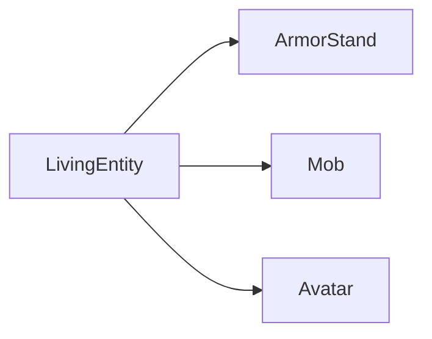
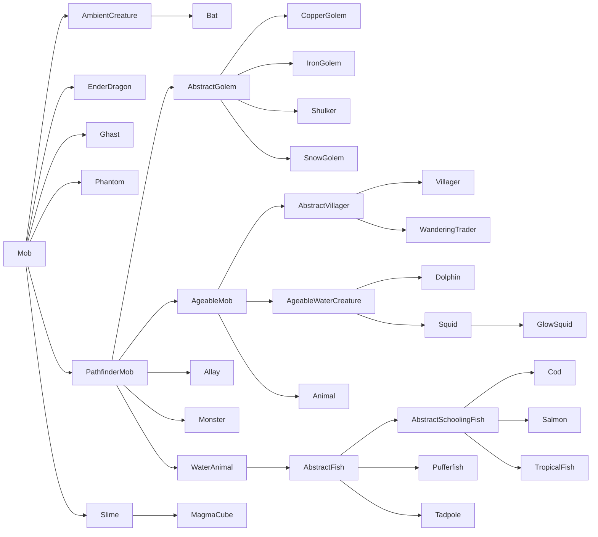
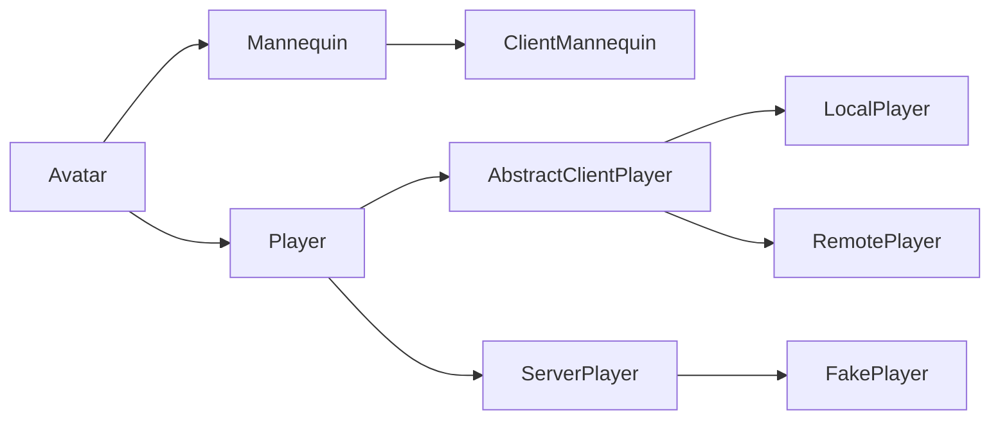

# 生物实体、生物与玩家 {#living-entities-mobs--players}

生物实体是[实体][entities]的一大子群，它们都继承自共同的 `LivingEntity` 超类。这包括生物（通过 `Mob` 子类）、玩家（通过 `Player` 子类）和盔甲架（通过 `ArmorStand` 子类）。

生物实体拥有许多普通实体所没有的额外属性。这些包括[属性][attributes]、[状态效果][mobeffects]、伤害追踪等。

## 生命值、伤害与治疗 {#health-damage-and-healing}

_另见：[属性][attributes]。_

生物实体区别于其他实体的最显著特性之一，就是完备的生命值系统。生物实体通常拥有最大生命值、当前生命值，有时还有护甲或自然回复之类的东西。

默认情况下，最大生命值由 `minecraft:max_health` [属性][attributes]决定，当前生命值在[生成][spawning]时被设为相同的值。当通过对实体调用 [`Entity#hurtServer`][hurt] 使其受到伤害时，当前生命值会根据伤害计算相应减少。许多实体（例如僵尸）默认会保持在这个降低后的生命值上，而某些实体（例如玩家）则可以再次回复这些损失的生命值。

要获取或设置最大生命值，需直接读取或写入该属性，如下所示：

```java
// Get the attribute map of our entity.
AttributeMap attributes = entity.getAttributes();

// Get the max health of our entity.
float maxHealth = attributes.getValue(Attributes.MAX_HEALTH);
// Shortcut for the above.
maxHealth = entity.getMaxHealth();

// Setting the max health must either be done by getting the AttributeInstance and calling #setBaseValue, or by
// adding an attribute modifier. We will do the former here. Please refer to the Attributes article for more details.
attributes.getInstance(Attributes.MAX_HEALTH).setBaseValue(50);
```

在[受到伤害][damage]时，生物实体会应用一些额外的计算，例如考虑 `minecraft:armor` 属性（处于 `minecraft:bypasses_armor` [标签][tags]中的[伤害类型][damagetypes]除外）以及 `minecraft:absorption` 属性。生物实体还可以重写 `#onDamageTaken` 来执行攻击后的行为；它只在最终伤害值大于零时才会被调用。

### 伤害事件 {#damage-events}

由于伤害流程的复杂性，有多个事件供你挂钩，它们按此处列出的顺序触发。这一般适用于你想对不（或不一定）属于自己的实体做的伤害修改，即：如果你想修改对 Minecraft 或其他 Mod 的实体造成的伤害，或者想修改对任意实体（无论是否属于你自己）造成的伤害。

所有这些事件的共同点是 `DamageContainer`。每次攻击开始时会实例化一个新的 `DamageContainer`，攻击结束后将其丢弃。它包含原始的 [`DamageSource`][damagesources]、原始伤害量，以及所有单项修改（护甲、伤害吸收、[附魔][enchantments]、[状态效果][mobeffects]等）的列表。`DamageContainer` 会传递给下面列出的所有事件，你可以检查已经做了哪些修改，以便按需做出自己的改动。

#### `EntityInvulnerabilityCheckEvent` {#entityinvulnerabilitycheckevent}

该事件允许 Mod 为实体绕过、也能添加无敌状态。该事件对非生物实体也会触发。你会用这个事件让实体对某次攻击免疫，或剥离它可能已有的某种免疫。

出于技术原因，该事件的挂钩应当是确定性的，且只依赖于伤害类型。这意味着随机几率的无敌状态、或仅在伤害量达到某阈值前才生效的无敌状态，应当改为在 `LivingIncomingDamageEvent`（见下文）中添加。

#### `LivingIncomingDamageEvent` {#livingincomingdamageevent}

该事件只在服务端调用，应当用于两个主要用例：动态取消攻击，以及添加减免修饰回调。

动态取消攻击基本上就是添加一种非确定性的无敌，例如随机取消伤害的几率、依赖当日时间或已受伤害量的无敌等。一致性的无敌应当通过 `EntityInvulnerabilityCheckEvent`（见上文）来实现。

减免修饰回调允许你修改所执行的伤害减免的某个部分。例如，它能让你将护甲伤害减免的效果降低 50%。这随后也会正确地传播到状态效果，使其得到一个不同的伤害量来处理，如此等等。减免修饰回调可以像下面这样添加：

```java
@SubscribeEvent // on the game event bus
public static void decreaseArmor(LivingIncomingDamageEvent event) {
    // We only apply this decrease to players and leave zombies etc. unchanged
    if (event.getEntity() instanceof Player) {
        // Add our reduction modifier callback.
        event.addReductionModifier(
            // The reduction to target. See the DamageContainer.Reduction enum for possible values.
            DamageContainer.Reduction.ARMOR,
            // The modification to perform. Gets the damage container and the base reduction as inputs,
            // and outputs the new reduction. Both input and output reductions are floats.
            (container, baseReduction) -> baseReduction * 0.5f
        );
    }
}
```

回调按其添加顺序应用。这意味着在具有更高[优先级][priority]的事件处理器中添加的回调会先运行。

#### `LivingShieldBlockEvent` {#livingshieldblockevent}

该事件可用于完全自定义盾牌格挡。这包括引入额外的盾牌格挡、阻止盾牌格挡、修改原版盾牌格挡检查、更改对盾牌或攻击物品造成的伤害、更改盾牌的视角弧度、允许抛射物但格挡近战攻击（或反之）、被动格挡攻击（即不使用盾牌）、只格挡一定百分比的伤害等。

请注意，该事件的设计目的不是处理超出“盾牌类”物品范畴的免疫或攻击取消。

#### `ArmorHurtEvent` {#armorhurtevent}

该事件应当相当不言自明。它在计算攻击造成的护甲损伤时触发，可用于修改对哪件护甲造成多少耐久损伤（乃至是否造成损伤）。

#### `LivingDamageEvent.Pre` {#livingdamageeventpre}

该事件在伤害造成之前的一刻调用。此时 `DamageContainer` 已完全填充，最终伤害量已可用，并且由于此刻攻击已被视为成功，事件不能再被取消。

在此刻，各类修饰符均可用，允许你精细地修改伤害量。请注意，护甲损伤之类的处理在此刻已经完成。

#### `LivingDamageEvent.Post` {#livingdamageeventpost}

该事件在伤害已造成、伤害吸收已减少、战斗追踪器已更新、统计与游戏事件已处理之后调用。它不可取消，因为攻击已经发生。该事件通常用于攻击后效果。请注意，即便伤害量为零该事件也会触发，因此如有需要请相应地检查该值。

如果你是对自己的实体调用它，应当考虑改为重写 `ILivingEntityExtension#onDamageTaken()`。与 `LivingDamageEvent.Post` 不同，它只在伤害大于零时才被调用。

## 状态效果 {#mob-effects}

_见[状态效果与药水][mobeffects]。_

## 装备 {#equipment}

_见[实体上的容器][containers]。_

## 层级结构 {#hierarchy}

生物实体拥有复杂的类层级结构。如前所述，它有三个直接子类（红色的类是 `abstract`，蓝色的类不是）：



其中，`ArmorStand` 没有子类（也是唯一的非抽象类），因此我们将聚焦于 `Mob` 和 `Avatar` 的类层级结构。

### `Mob` 的层级结构 {#hierarchy-of-mob}

`Mob` 的类层级结构如下所示（红色的类是 `abstract`，蓝色的类不是）：



图中未列出的所有其他生物实体，都是 `Animal` 或 `Monster` 的子类。

你可能已经注意到，这非常混乱。例如，为什么蜜蜂、鹦鹉等不也是飞行生物？当深入查看 `Animal` 和 `Monster` 的子类层级时，这个问题会变得更加糟糕，这里就不详细讨论了（如果你感兴趣，可以用 IDE 的 Show Hierarchy 功能去查看它们）。最好是承认它的存在，但不必为之烦恼。

我们来过一遍最重要的几个类：

- `PathfinderMob`：包含（意料之中！）寻路逻辑。
- `AgeableMob`：包含衰老与幼年实体的逻辑。带有幼年变体的僵尸和其他怪物不继承这个类，它们反而是 `Monster` 的子类。
- `Animal`：大多数动物所继承的类。有进一步的抽象子类，例如 `AbstractHorse` 或 `TamableAnimal`。
- `Monster`：游戏视为怪物的大多数实体的抽象类。与 `Animal` 一样，它也有进一步的抽象子类，例如 `AbstractPiglin`、`AbstractSkeleton`、`Raider` 和 `Zombie`。
- `WaterAnimal`：水生动物（如鱼、鱿鱼和海豚）的抽象类。由于寻路方式明显不同，它们与其他动物区分开来。

### `Avatar` 的层级结构 {#hierarchy-of-avatar}

Avatar 不仅定义玩家，还定义一种类玩家的人偶（mannequin）。根据 avatar 所在的端，会使用不同的类。除了 `FakePlayer` 和 `Mannequin` 之外，你应该永远不需要自己构造 avatar。



- `AbstractClientPlayer`：该类用作两个客户端玩家的基类，二者都用于在[逻辑客户端][logicalsides]上表示玩家。
- `LocalPlayer`：该类用于表示当前正在运行游戏的玩家。
- `RemotePlayer`：该类用于表示 `LocalPlayer` 在多人游戏中可能遇到的其他玩家。因此，`RemotePlayer` 在单人游戏场景中不存在。
- `ServerPlayer`：该类用于在[逻辑服务端][logicalsides]上表示玩家。
- `FakePlayer`：这是 `ServerPlayer` 的一个特殊子类，设计用作玩家的模拟对象，供需要玩家上下文的非玩家机制使用。
- `Mannequin`：该类设计用作可摆姿势的玩家，通常不带任何 AI。
- `ClientMannequin`：该类用于在[逻辑客户端][logicalsides]上表示人偶。

## 生成 {#spawning}

除了[常规的生成方式][spawning]——即 `/summon` 命令以及通过 `EntityType#spawn` 或 `Level#addFreshEntity` 的代码方式——之外，`Mob` 还可以通过其他一些方式生成。`ArmorStand` 可以通过常规方式生成，而 `Player` 不应由你自己实例化，`FakePlayer` 除外。

### 刷怪蛋 {#spawn-eggs}

为生物[注册][register]一个刷怪蛋是常见做法（尽管并非必需）。这通过 `SpawnEggItem` 类和 `DataComponents#ENTITY_DATA` [数据组件][datacomponent]完成：

```java
// Assume we have a DeferredRegister.Items called ITEMS
DeferredItem<SpawnEggItem> MY_ENTITY_SPAWN_EGG = ITEMS.registerItem("my_entity_spawn_egg",
    properties -> new SpawnEggItem(
        // The properties passed into the lambda.
        // Using `spawnEgg` to set the DataComponent.
        // This is done in the lambda to prevent the entity type from resolving before registration.
        properties.spawnEgg(MY_ENTITY_TYPE.get())
    ));
```

作为与其他物品别无二致的物品，该物品应被添加到[创造模式物品栏][creative]，并应为其添加[客户端物品][clientitem]、[模型][model]和[翻译][translation]。

### 自然生成 {#natural-spawning}

_另见[实体/`MobCategory`][mobcategory]、[世界生成/生物群系修改器/添加生成][addspawns]、[世界生成/生物群系修改器/添加生成消耗][addspawncosts]；以及 [Minecraft Wiki][mcwiki] 上的[生成周期][spawncycle]。_

自然生成对 `MobCategory#isFriendly()` 为 true 的实体（默认为所有非怪物实体）每 tick 执行一次，对 `MobCategory#isFriendly()` 为 false 的实体（所有怪物）每 400 tick（\= 20 秒）执行一次。如果 `MobCategory#isPersistent()` 返回 true（主要是动物），这一过程还会额外在区块生成时发生。

对于每个区块和每个生物类别，会检查是否已达到生成上限。更技术地说，这是检查在周围 `loadedChunks` 区域内该 `MobCategory` 的实体是否少于 `MobCategory#getMaxInstancesPerChunk() * loadedChunks / 289`，其中 `loadedChunks` 至多为以当前区块为中心的 17x17 区块区域，若加载的区块更少（由于渲染距离或类似原因），则为更少的区块。

接下来，对于每个区块，要求在至少一名玩家附近该 `MobCategory` 的实体少于 `MobCategory#getMaxInstancesPerChunk()` 个（“附近”指生物与玩家之间的距离 \<\= 128），该 `MobCategory` 的生成才会发生。

如果满足这些条件，就会从相关生物群系的生成数据中随机选取一个条目，并在能找到合适位置时进行生成。至多有三次寻找随机位置的尝试；如果找不到位置，则不会发生生成。

#### 示例 {#example}

听起来很复杂？我们通过一个平原生物群系中动物的示例来梳理一遍。

在平原生物群系中，游戏每 tick 都会尝试从 `CREATURE` 生物类别生成实体，该类别包含以下条目：

```json5
[
    {"type": "minecraft:sheep",   "minCount": 4, "maxCount": 4, "weight": 12},
    {"type": "minecraft:pig",     "minCount": 4, "maxCount": 4, "weight": 10},
    {"type": "minecraft:chicken", "minCount": 4, "maxCount": 4, "weight": 10},
    {"type": "minecraft:cow",     "minCount": 4, "maxCount": 4, "weight": 8 },
    {"type": "minecraft:horse",   "minCount": 2, "maxCount": 6, "weight": 5 },
    {"type": "minecraft:donkey",  "minCount": 1, "maxCount": 3, "weight": 1 }
]
```

由于 `CREATURE` 的生成上限是 10，会扫描以每名玩家当前区块为中心的至多 17x17 区块，查找其他 `CREATURE` 类型的实体。如果找到的实体 \<\= 10 * chunkCount / 289 个（这基本上意味着在未加载区块附近，生成几率会变高），则会对每个找到的实体做与最近玩家的距离检查。如果其中至少有一个的距离大于 128，就可以发生生成。

如果所有这些检查都通过，就会根据权重从上述列表中选取一个生成条目。假设选中了猪。游戏随后会检查区块中的一个随机位置是否适合生成该实体。如果位置合适，就会按照生成数据中指定的最小和最大数量生成实体（因此在我们的例子中恰好是 4 头猪）。如果位置不合适，游戏会用不同的位置再尝试两次。如果仍找不到位置，则取消生成。

[addspawncosts]: ../worldgen/biomemodifier.md#add-spawn-costs
[addspawns]: ../worldgen/biomemodifier.md#add-spawns
[attributes]: attributes.md
[clientitem]: ../resources/client/models/items.md
[containers]: ../inventories/container.md
[creative]: ../items/index.md#creative-tabs
[damage]: index.md#damaging-entities
[damagesources]: ../resources/server/damagetypes.md#creating-and-using-damage-sources
[damagetypes]: ../resources/server/damagetypes.md
[datacomponent]: ../items/datacomponents.md
[enchantments]: ../resources/server/enchantments/index.md
[entities]: index.md
[hurt]: index.md#damaging-entities
[logicalsides]: ../concepts/sides.md#the-logical-side
[mcwiki]: https://minecraft.wiki
[mobcategory]: index.md#mobcategory
[mobeffects]: ../items/mobeffects.md
[model]: ../resources/client/models/index.md
[priority]: ../concepts/events.md#priority
[register]: ../concepts/registries.md
[spawncycle]: https://minecraft.wiki/w/Mob_spawning#Spawn_cycle
[spawning]: index.md#spawning-entities
[tags]: ../resources/server/tags.md
[translation]: ../resources/client/i18n.md
