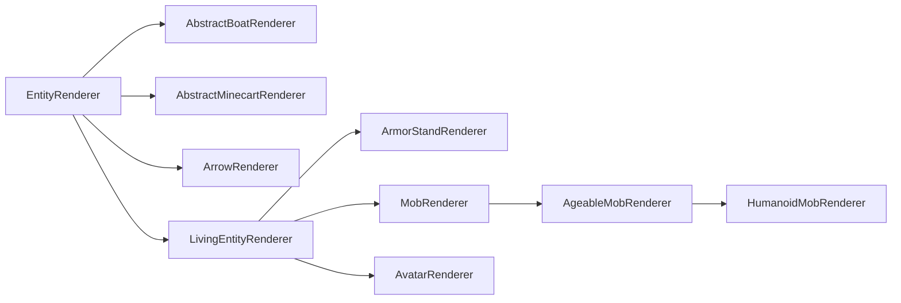

# 实体渲染器 {#entity-renderers}

实体渲染器用于为实体定义渲染行为。它们只存在于[逻辑客户端与物理客户端][sides]上。

实体渲染使用实体渲染状态（entity render state）。简单来说，它是保存渲染器所需全部数据的对象。每次渲染实体时，系统都会先更新渲染状态，再由 `#submit` 方法根据该状态提交[渲染元素][features]，供稍后的渲染阶段绘制实体。

## 创建实体渲染器 {#creating-an-entity-renderer}

最简单的实体渲染器是直接继承 `EntityRenderer` 的那种：

```java
// The generic type in the superclass should be set to what entity you want to render.
// If you wanted to enable rendering for any entity, you'd use Entity, like we do here.
// You'd also use an EntityRenderState that fits your use case. More on this below.
public class MyEntityRenderer extends EntityRenderer<Entity, EntityRenderState> {
    // In our constructor, we just forward to super.
    public MyEntityRenderer(EntityRendererProvider.Context context) {
        super(context);
    }

    // Tell the render engine how to create a new entity render state.
    @Override
    public EntityRenderState createRenderState() {
        return new EntityRenderState();
    }

    // Update the render state by copying the needed values from the passed entity to the passed state.
    // Both Entity and EntityRenderState may be replaced with more concrete types,
    // based on the generic types that have been passed to the supertype.
    @Override
    public void extractRenderState(Entity entity, EntityRenderState state, float partialTick) {
        super.extractRenderState(entity, state, partialTick);
        // Extract and store any additional values in the state here.
    }
    
    // Actually submit the features of the entity to render.
    // The first parameter matches the render state's generic type.
    // Calling super will handle leash and name tag submission for you, if applicable.
    @Override
    public void submit(EntityRenderState renderState, PoseStack poseStack, SubmitNodeCollector collector, CameraRenderState cameraState) {
        super.submit(renderState, poseStack, collector, cameraState);
        // Do your own submission here
    }
}
```

现在我们有了实体渲染器，还需要注册它并将其与所属实体关联起来。这在 [`EntityRenderersEvent.RegisterRenderers`][events] 中完成，如下所示：

```java
@SubscribeEvent // on the mod event bus only on the physical client
public static void registerEntityRenderers(EntityRenderersEvent.RegisterRenderers event) {
    event.registerEntityRenderer(MY_ENTITY_TYPE.get(), MyEntityRenderer::new);
}
```

## 实体渲染状态 {#entity-render-states}

如前所述，实体渲染状态用于把渲染所用的值与实体本身的值分离开来。它们别无他物，实际上只是可变的数据存储对象。因此，扩展它非常简单：

```java
public class MyEntityRenderState extends EntityRenderState {
    public ItemStackRenderState stackInHand;
}
```

就是这么简单。继承该类，添加你的字段，把 `EntityRenderer` 中的泛型类型改成你的类，然后就可以了。现在唯一剩下的事，就是在 `EntityRenderer#extractRenderState` 中更新那个 `stackInHand` 字段，如上文所述。

### 渲染状态修改 {#render-state-modifications}

除了能够定义新的实体渲染状态之外，NeoForge 还引入了一套允许修改已有渲染状态的系统。

为此，可以创建一个 `ContextKey<T>`（其中 `T` 是你想更改的数据的类型）并存储在静态字段中。然后，你可以在 `RegisterRenderStateModifiersEvent` 的事件处理器中使用它，如下所示：

```java
public static final ContextKey<String> EXAMPLE_CONTEXT = new ContextKey<>(
    // The id of your context key. Used for distinguishing between keys internally.
    Identifier.fromNamespaceAndPath("examplemod", "example_context"));

@SubscribeEvent // on the mod event bus only on the physical client
public static void registerRenderStateModifiers(RegisterRenderStateModifiersEvent event) {
    event.registerEntityModifier(
        // A TypeToken for the renderer. It is REQUIRED for this to be instantiated as an anonymous class
        // (i.e., with {} at the end) and to have explicit generic parameters, due to generics nonsense.
        new TypeToken<LivingEntityRenderer<LivingEntity, LivingEntityRenderState, ?>>(){},
        // The modifier itself. This is a BiConsumer of the entity and the entity render state.
        // Exact generic types are inferred from the generics in the renderer class used.
        (entity, state) -> state.setRenderData(EXAMPLE_CONTEXT, "Hello World!");
    );
    
    // Overload of the above method that accepts a Class<?>.
    // This should ONLY be used for renderers without any generics, such as PigRenderer.
    event.registerEntityModifier(
        PigRenderer.class,
        (entity, state) -> state.setRenderData(EXAMPLE_CONTEXT, "Hello World!");
    );

    // Convenience method for working around issues around modifying an avatar's
    // render state (e.g. players).
    event.registerAvatarEntityModifier(new AvatarRenderStateModifier() {
        @Override
        public <T extends Avatar & ClientAvatarEntity> void accept(T avatar, AvatarRenderState state) {
            state.setRenderData(EXAMPLE_CONTEXT, "Hello World!");
        }
    });
}
```

:::tip
向 `EntityRenderState#setRenderData` 传入 `null` 作为第二个参数，即可清除该值。例如：

```java
state.setRenderData(EXAMPLE_CONTEXT, null);
```
:::

随后，这些数据可以在需要处通过 `EntityRenderState#getRenderData` 取回。此外还提供了辅助方法 `#getRenderDataOrThrow` 和 `#getRenderDataOrDefault`。

## 层级结构 {#hierarchy}

与实体本身一样，实体渲染器也有一套类层级结构，尽管层次没那么多。该层级结构中最重要的几个类的关系如下（红色的类是 `abstract`，蓝色的类不是）：



- `EntityRenderer`：抽象基类。许多渲染器，尤其是几乎所有非生物实体的渲染器，都直接继承这个类。
- `ArrowRenderer`、`AbstractBoatRenderer`、`AbstractMinecartRenderer`：它们主要为了方便而存在，用作更具体渲染器的父类。
- `LivingEntityRenderer`：[生物实体][livingentity]渲染器的抽象基类。直接子类包括 `ArmorStandRenderer` 和 `AvatarRenderer`。
- `ArmorStandRenderer`：顾名思义。
- `AvatarRenderer`：用于渲染 avatar（例如玩家）。请注意，与大多数其他渲染器不同，用于不同上下文的该类的多个实例可以同时存在。
- `MobRenderer`：`Mob` 渲染器的抽象基类。许多渲染器直接继承它。
- `AgeableMobRenderer`：拥有幼年变体的 `Mob` 的渲染器的抽象基类。这包括拥有幼年变体的怪物，例如疣猪兽。
- `HumanoidMobRenderer`：人形实体渲染器的抽象基类。由僵尸和骷髅等使用。

与各种实体类一样，使用最契合你用例的那个。请注意，这些类中许多在其泛型上都有对应的类型上界；例如，`LivingEntityRenderer` 对 `LivingEntity` 和 `LivingEntityRenderState` 有类型上界。

## 实体模型、层定义与渲染层 {#entity-models-layer-definitions-and-render-layers}

更复杂的实体渲染器，尤其是 `LivingEntityRenderer`，使用一套层（layer）系统，其中每一层都表示为一个 `RenderLayer`。一个渲染器可以使用多个 `RenderLayer`，并且该渲染器可以决定在什么时候提交哪些层。例如，鞘翅使用一个独立的层，它的处理独立于穿戴它的 `LivingEntity`。同样地，玩家的披风也是一个独立的层。

`RenderLayer` 定义了一个 `#submit` 方法，用于提交绘制该层所需的[渲染元素][features]。与大多数其他 `submit` 方法一样，你基本上可以在其中提交任意内容。不过，最常见的用法是提交独立模型，例如护甲或类似的装备部件。

为此，我们首先需要一个可供提交的模型。我们使用 `Model` 类来做这件事。`Model` 本质上是供渲染器使用的一列立方体及其关联纹理。它们通常在实体渲染器的构造函数首次创建时以静态方式创建。

:::note
由于我们现在操作的是 `LivingEntityRenderer`，接下来的代码将假定 `MyEntity extends LivingEntity` 且 `MyEntityRenderState extends LivingEntityRenderState`，以匹配泛型类型上界。
:::

### 创建实体模型类与层定义 {#creating-an-entity-model-class-and-a-layer-definition}

我们先从创建一个实体模型类开始：

```java
public class MyEntityModel extends EntityModel<MyEntityRenderState> {}
```

请注意，在上面的示例中，我们直接继承了 `EntityModel`；根据你的用例，改用其中某个子类，甚至只用 `Model` 或 `Model` 的某个与实体无关的子类，可能更为合适。在创建新模型时，推荐你先看看与你用例最接近的现有模型，然后在此基础上着手。

接下来，我们创建一个 `LayerDefinition`。`LayerDefinition` 本质上是一列立方体，随后我们可以将其烘焙（bake）为一个 `EntityModel`。定义 `LayerDefinition` 大致是这样：

```java
public class MyEntityModel extends EntityModel<MyEntityRenderState> {
    // A static method in which we create our layer definition. createBodyLayer() is the name
    // most vanilla models use. If you have multiple layers, you will have multiple of these static methods.
    public static LayerDefinition createBodyLayer() {
        // Create our mesh.
        MeshDefinition mesh = new MeshDefinition();
        // The mesh initially contains no object other than the root, which is invisible (has a size of 0x0x0).
        PartDefinition root = mesh.getRoot();
        // We add a head part.
        PartDefinition head = root.addOrReplaceChild(
            // The name of the part.
            "head",
            // The CubeListBuilder we want to add.
            CubeListBuilder.create()
                // The UV coordinates to use within the texture. Texture binding itself is explained below.
                // In this example, we start at U=10, V=20.
                .texOffs(10, 20)
                // Add our cube. May be called multiple times to add multiple cubes.
                // This is relative to the parent part. For the root part, it is relative to the entity's position.
                // Be aware that the y axis is flipped, i.e. "up" is subtractive and "down" is additive.
                .addBox(
                    // The top-left-back corner of the cube, relative to the parent object's position.
                    -5, -5, -5,
                    // The size of the cube.
                    10, 10, 10
                )
                // Call texOffs and addBox again to add another cube.
                .texOffs(30, 40)
                .addBox(-1, -1, -1, 1, 1, 1)
                // Various overloads of addBox() are available, which allow for additional operations
                // such as texture mirroring, texture scaling, specifying the directions to be rendered,
                // and a global scale to all cubes, known as a CubeDeformation.
                // This example uses the latter, please check the usages of the individual methods for more examples.
                .texOffs(50, 60)
                .addBox(5, 5, 5, 4, 4, 4, CubeDeformation.extend(1.2f)),
            // The initial positioning to apply to all elements of the CubeListBuilder. Besides PartPose#offset,
            // PartPose#offsetAndRotation is also available. This can be reused across multiple PartDefinitions.
            // This may not be used by all models. For example, making custom armor layers will use the associated
            // player (or other humanoid) renderer's PartPose instead to have the armor "snap" to the player model.
            PartPose.offset(0, 8, 0)
        );
        // We can now add children to any PartDefinition, thus creating a hierarchy.
        PartDefinition part1 = root.addOrReplaceChild(...);
        PartDefinition part2 = head.addOrReplaceChild(...);
        PartDefinition part3 = part1.addOrReplaceChild(...);
        // At the end, we create a LayerDefinition from the MeshDefinition.
        // The two integers are the expected dimensions of the texture; 64x32 in our example.
        return LayerDefinition.create(mesh, 64, 32);
    }
}
```

:::tip
[Blockbench][blockbench] 建模程序在创建实体模型时是一大助力。为此，在 Blockbench 中创建模型时选择 Modded Entity 选项。

Blockbench 还提供了将模型导出为 `LayerDefinition` 创建方法的选项，可在 `File -> Export -> Export Java Entity` 中找到。
:::

### 注册层定义 {#registering-a-layer-definition}

有了实体层定义之后，我们需要在 `EntityRenderersEvent.RegisterLayerDefinitions` 中注册它。为此，我们需要一个 `ModelLayerLocation`，它本质上充当我们这一层的标识符（记住，一个实体可以有多个层）。

```java
// Our ModelLayerLocation.
public static final ModelLayerLocation MY_LAYER = new ModelLayerLocation(
    // Should be the name of the entity this layer belongs to.
    // May be more generic if this layer can be used on multiple entities.
    Identifier.fromNamespaceAndPath("examplemod", "example_entity"),
    // The name of the layer itself. Should be main for the entity's base model,
    // and a more descriptive name (e.g. "wings") for more specific layers.
    "main"
);

@SubscribeEvent // on the mod event bus only on the physical client
public static void registerLayerDefinitions(EntityRenderersEvent.RegisterLayerDefinitions event) {
    // Add our layer here.
    event.add(MY_LAYER, MyEntityModel::createBodyLayer);
}
```

### 创建渲染层并烘焙层定义 {#creating-a-render-layer-and-baking-a-layer-definition}

下一步是烘焙层定义，为此我们先回到实体模型类：

```java
public class MyEntityModel extends EntityModel<MyEntityRenderState> {
    // Storing specific model parts as fields for use below.
    private final ModelPart head;
    
    // The ModelPart passed here is the root of our baked model.
    // We will get to the actual baking in just a moment.
    public MyEntityModel(ModelPart root) {
        // The super constructor call can optionally specify a RenderType.
        super(root);
        // Store the head part for use below.
        this.head = root.getChild("head");
    }

    public static LayerDefinition createBodyLayer() {...}

    // Use this method to update the model rotations, visibility etc. from the render state. If you change the
    // generic parameter of the EntityModel superclass, this parameter type changes with it.
    @Override
    public void setupAnim(MyEntityRenderState state) {
        // Calling super to reset all values to default.
        super.setupAnim(state);
        // Change the model parts.
        head.visible = state.myBoolean();
        head.xRot = state.myXRotation();
        head.yRot = state.myYRotation();
        head.zRot = state.myZRotation();
    }
}
```

现在我们的模型能够正确地接收一个烘焙后的 `ModelPart` 了，我们可以创建 `RenderLayer` 子类，并用它来烘焙 `LayerDefinition`，如下所示：

```java
// The generic parameters need the proper types you used everywhere else up to this point.
public class MyRenderLayer extends RenderLayer<MyEntityRenderState, MyEntityModel> {
    private final MyEntityModel model;
    
    // Create the render layer. The renderer parameter is required for passing to super.
    // Other parameters can be added as needed. For example, we need the EntityModelSet for model baking.
    public MyRenderLayer(MyEntityRenderer renderer, EntityModelSet entityModelSet) {
        super(renderer);
        // Bake and store our layer definition, using the ModelLayerLocation from back when we registered the layer definition.
        // If applicable, you can also store multiple models this way and use them below.
        this.model = new MyEntityModel(entityModelSet.bakeLayer(MY_LAYER));
    }

    @Override
    public void submit(PoseStack poseStack, SubmitNodeCollector collector, int lightCoords, MyEntityRenderState renderState, float yRot, float xRot) {
        // Submit the features for the layer here. We have stored the entity model in a field, you probably want to use it in some way.
        collector
            .order(1) // We submit the feature on a later iteration so it renders on top of the entity
            .submitModel(this.model, renderState, poseStack, ...);
    }
}
```

### 为实体渲染器添加渲染层 {#adding-a-render-layer-to-an-entity-renderer}

最后，为了把这一切串联起来，我们可以将该层添加到我们的渲染器（如果你还记得，它现在需要是一个生物渲染器），如下所示：

```java
// Plugging in our custom render state class as the generic type.
// Also, we need to implement RenderLayerParent. Some existing renderers, such as LivingEntityRenderer, do this for you.
public class MyEntityRenderer extends LivingEntityRenderer<MyEntity, MyEntityRenderState, MyEntityModel> {
    public MyEntityRenderer(EntityRendererProvider.Context context) {
        // For LivingEntityRenderer, the super constructor requires a "base" model and a shadow radius to be supplied.
        super(context, new MyEntityModel(context.bakeLayer(MY_LAYER)), 0.5f);
        // Add the layer. Get the EntityModelSet from the context. For the purpose of the example,
        // we ignore that the render layer submits the "base" model, this would be a different model in practice.
        this.addLayer(new MyRenderLayer(this, context.getModelSet()));
    }

    @Override
    public MyEntityRenderState createRenderState() {
        return new MyEntityRenderState();
    }

    @Override
    public void extractRenderState(MyEntity entity, MyEntityRenderState state, float partialTick) {
        super.extractRenderState(entity, state, partialTick);
        // Extract your own stuff here, see the beginning of the article.
    }

    @Override
    public void submit(MyEntityRenderState renderState, PoseStack poseStack, SubmitNodeCollector collector, CameraRenderState cameraState) {
        // Calling super will automatically submit the features of the layer for you.
        super.submit(renderState, poseStack, collector, cameraState);
        // Then, do custom submission here, if applicable.
    }

    // getTextureLocation is an abstract method in LivingEntityRenderer that we need to override.
    // The texture path is relative to the namespace, so it must specify the exact path within the namespace in the assets directory.
    // In this example, the texture should be located at `assets/examplemod/textures/entity/example_entity.png`.
    // The texture will then be supplied to and used by the model.
    @Override
    public Identifier getTextureLocation(MyEntityRenderState state) {
        return Identifier.fromNamespaceAndPath("examplemod", "textures/entity/example_entity.png");
    }
}
```

### 一次性汇总 {#all-at-once}

有点多？由于这套系统相当复杂，这里把所有组件不带（几乎任何）废话地再列一遍：

```java
public class MyEntity extends LivingEntity {...}
```

```java
public class MyEntityRenderState extends LivingEntityRenderState {...}
```

```java
public class MyEntityModel extends EntityModel<MyEntityRenderState> {
    public static final ModelLayerLocation MY_LAYER = new ModelLayerLocation(
            Identifier.fromNamespaceAndPath("examplemod", "example_entity"),
            "main"
    );
    private final ModelPart head;
    
    public MyEntityModel(ModelPart root) {
        super(root);
        this.head = root.getChild("head");
        // ...
    }

    public static LayerDefinition createBodyLayer() {
        MeshDefinition mesh = new MeshDefinition();
        PartDefinition root = mesh.getRoot();
        PartDefinition head = root.addOrReplaceChild(
            "head",
            CubeListBuilder.create().texOffs(10, 20).addBox(-5, -5, -5, 10, 10, 10),
            PartPose.offset(0, 8, 0)
        );
        // ...
        return LayerDefinition.create(mesh, 64, 32);
    }

    @Override
    public void setupAnim(MyEntityRenderState state) {
        super.setupAnim(state);
        // ...
    }
}
```

```java
public class MyRenderLayer extends RenderLayer<MyEntityRenderState, MyEntityModel> {
    private final MyEntityModel model;
    
    public MyRenderLayer(MyEntityRenderer renderer, EntityModelSet entityModelSet) {
        super(renderer);
        this.model = new MyEntityModel(entityModelSet.bakeLayer(MY_LAYER));
    }

    @Override
    public void submit(PoseStack poseStack, SubmitNodeCollector collector, int lightCoords, MyEntityRenderState renderState, float yRot, float xRot) {
        // ...
    }
}
```

```java
public class MyEntityRenderer extends LivingEntityRenderer<MyEntity, MyEntityRenderState, MyEntityModel> {
    public MyEntityRenderer(EntityRendererProvider.Context context) {
        super(context, new MyEntityModel(context.bakeLayer(MY_LAYER)), 0.5f);
        this.addLayer(new MyRenderLayer(this, context.getModelSet()));
    }

    @Override
    public MyEntityRenderState createRenderState() {
        return new MyEntityRenderState();
    }

    @Override
    public void extractRenderState(MyEntity entity, MyEntityRenderState state, float partialTick) {
        super.extractRenderState(entity, state, partialTick);
        // ...
    }

    @Override
    public void submit(MyEntityRenderState renderState, PoseStack poseStack, SubmitNodeCollector collector, CameraRenderState cameraState) {
        super.submit(renderState, poseStack, collector, cameraState);
        // ...
    }

    @Override
    public Identifier getTextureLocation(MyEntityRenderState state) {
        return Identifier.fromNamespaceAndPath("examplemod", "textures/entity/example_entity.png");
    }
}
```

```java
@SubscribeEvent // on the mod event bus only on the physical client
public static void registerLayerDefinitions(EntityRenderersEvent.RegisterLayerDefinitions event) {
    event.add(MyEntityModel.MY_LAYER, MyEntityModel::createBodyLayer);
}

@SubscribeEvent // on the mod event bus only on the physical client
public static void registerEntityRenderers(EntityRenderersEvent.RegisterRenderers event) {
    event.registerEntityRenderer(MY_ENTITY_TYPE.get(), MyEntityRenderer::new);
}
```

## 修改已有的实体渲染器 {#modifying-existing-entity-renderers}

在某些场景下，向已有的实体渲染器中添加内容是可取的，例如为已有实体渲染额外的效果。大多数情况下，这会影响生物实体，即拥有 `LivingEntityRenderer` 的实体。这让我们能够像下面这样为实体添加[渲染层][renderlayer]：

```java
@SubscribeEvent // on the mod event bus only on the physical client
public static void addLayers(EntityRenderersEvent.AddLayers event) {
    // Add a layer to every single entity type.
    for (EntityType<?> entityType : event.getEntityTypes()) {
        // Get our renderer.
        EntityRenderer<?, ?> renderer = event.getRenderer(entityType);
        // We check if our render layer is supported by the renderer.
        // If you want a more general-purpose render layer, you will need to work with wildcard generics.
        if (renderer instanceof MyEntityRenderer myEntityRenderer) {
            // Add the layer to the renderer. Like above, construct a new MyRenderLayer.
            // The EntityModelSet can be retrieved from the event through #getEntityModels.
            myEntityRenderer.addLayer(new MyRenderLayer(renderer, event.getEntityModels()));
        }
    }
}
```

对于玩家，需要一点特殊处理，因为实际上可能存在多个玩家渲染器。这些由该事件单独管理。我们可以像下面这样与它们交互：

```java
@SubscribeEvent // on the mod event bus only on the physical client
public static void addPlayerLayers(EntityRenderersEvent.AddLayers event) {
    // Iterate over all possible player models.
    for (PlayerModelType type : event.getSkins()) {
        // Get the associated AvatarRenderer.
        AvatarRenderer<AbstractClientPlayer> playerRenderer = event.getPlayerRenderer(type);
        if (playerRenderer != null) {
            // Add the layer to the renderer. This assumes that the render layer
            // has proper generics to support players and player renderers.
            playerRenderer.addLayer(new MyRenderLayer(playerRenderer, event.getEntityModels()));
        }
    }
}
```

## 动画 {#animations}

Minecraft 通过 `AnimationDefinition` 类为实体模型提供了一套动画系统。NeoForge 添加了一套系统，允许在 JSON 文件中定义这些实体动画，类似于 [GeckoLib][geckolib] 等第三方库。

动画定义在位于 `assets/<namespace>/neoforge/animations/entity/<path>.json` 的 JSON 文件中（因此对于[资源标识符][rl] `examplemod:example`，文件会位于 `assets/examplemod/neoforge/animations/entity/example.json`）。动画文件的格式如下：

```json5
{
    // The duration of the animation, in seconds.
    "length": 1.5,
    // Whether the animation should loop (true) or stop (false) when finished.
    // Optional, defaults to false.
    "loop": true,
    // A list of parts to be animated, and their animation data.
    "animations": [
        {
            // The name of the part to be animated. Must match the name of a part
            // defined in your LayerDefinition (see above). If there are multiple matches,
            // the first match from the performed depth-first search will be picked.
            "bone": "head",
            // The value to be changed. See below for available targets.
            "target": "minecraft:rotation",
            // A list of keyframes for the part.
            "keyframes": [
                {
                    // The timestamp of the keyframe, in seconds.
                    // Should be between 0 and the animation length.
                    "timestamp": 0.5,
                    // The actual "value" of the keyframe.
                    "target": [22.5, 0, 0],
                    // The interpolation method to use. See below for available methods.
                    "interpolation": "minecraft:linear"
                }
            ]
        }
    ]
}
```

:::tip
强烈推荐将这套系统与 [Blockbench][blockbench] 建模软件配合使用，它提供了一个[将动画导出为 JSON 的插件][bbplugin]。
:::

随后，在你的模型中，你可以像下面这样使用该动画：

```java
public class MyEntityModel extends EntityModel<MyEntityRenderState> {
    // Create and store a reference to the animation holder.
    public static final AnimationHolder EXAMPLE_ANIMATION =
            Model.getAnimation(Identifier.fromNamespaceAndPath("examplemod", "example"));

    // A field to hold the baked animation
    private final KeyframeAnimation example;

    public MyEntityModel(ModelPart root) {
        // Bake the animation for the model
        // Pass in whatever 'ModelPart' that the animation is applied to
        // It should cover all referenced bones
        this.example = EXAMPLE_ANIMATION.get().bake(root);
    }
    
    // Other stuff here.
    
    @Override
    public void setupAnim(MyEntityRenderState state) {
        super.setupAnim(state);
        // Other stuff here.
        
        this.example.apply(
            // Get the animation state to use from your EntityRenderState.
            state.myAnimationState,
            // Your entity age, in ticks.
            state.ageInTicks
        );
        // A specialized version of apply(), designed for walking animations.
        this.example.applyWalk(state.walkAnimationPos, state.walkAnimationSpeed, 1, 1);
        // A version of apply() that only applies the first frame of animation.
        this.example.applyStatic();
    }
}
```

### 关键帧目标 {#keyframe-targets}

NeoForge 开箱即用地添加了以下关键帧目标：

- `minecraft:position`：目标值被设为该部件的位置值。
- `minecraft:rotation`：目标值被设为该部件的旋转值。
- `minecraft:scale`：目标值被设为该部件的缩放值。

自定义值可以通过创建一个新的 `AnimationTarget` 并在 `RegisterJsonAnimationTypesEvent` 中注册它来添加，如下所示：

```java
@SubscribeEvent // on the mod event bus only on the physical client
public static void registerJsonAnimationTypes(RegisterJsonAnimationTypesEvent event) {
    event.registerTarget(
        // The name of the new target, to be used in JSON and other places.
        Identifier.fromNamespaceAndPath("examplemod", "example"),
        // The AnimationTarget to register.
        new AnimationTarget(...)
    );
}
```

### 关键帧插值 {#keyframe-interpolations}

NeoForge 开箱即用地添加了以下关键帧插值：

- `minecraft:linear`：线性插值。
- `minecraft:catmullrom`：沿 [Catmull-Rom 样条][catmullrom]插值。

自定义插值可以通过创建一个新的 `AnimationChannel.Interpolation`（它是一个函数式接口）并在 `RegisterJsonAnimationTypesEvent` 中注册它来添加，如下所示：

```java
@SubscribeEvent // on the mod event bus only on the physical client
public static void registerJsonAnimationTypes(RegisterJsonAnimationTypesEvent event) {
    event.registerInterpolation(
        // The name of the new interpolation, to be used in JSON and other places.
        Identifier.fromNamespaceAndPath("examplemod", "example"),
        // The AnimationChannel.Interpolation to register.
        (vector, keyframeDelta, keyframes, currentKeyframe, nextKeyframe, scale) -> {...}
    );
}
```

[bbplugin]: https://www.blockbench.net/plugins/animation_to_json
[blockbench]: https://www.blockbench.net/
[catmullrom]: https://en.wikipedia.org/wiki/Cubic_Hermite_spline#Catmull–Rom_spline
[events]: ../concepts/events.md
[features]: ../rendering/feature.md
[geckolib]: https://github.com/bernie-g/geckolib
[livingentity]: livingentity.md
[renderlayer]: #creating-a-render-layer-and-baking-a-layer-definition
[rl]: ../misc/identifier.md
[sides]: ../concepts/sides.md
