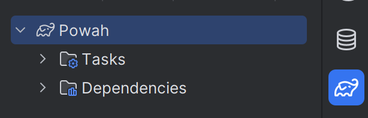
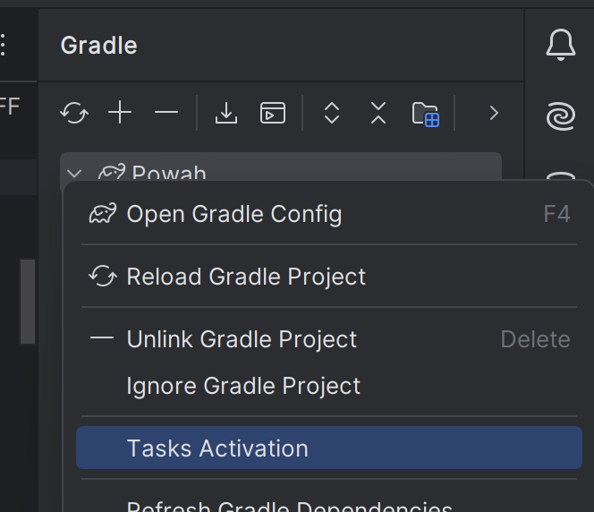
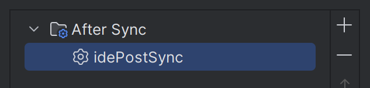

# ModDevGradle {#moddevgradle}


请在 NeoForged 项目列表中查看[最新版本](https://projects.neoforged.net/neoforged/ModDevGradle)。

如果你要升级到插件的新大版本，请参阅[破坏性变更列表](https://github.com/neoforged/ModDevGradle/blob/f3c0e31f5014da2c14a6576a51fc2dbe728cd4d4/BREAKING_CHANGES.md)。

## 特性 {#features}

- 采用最新的 Gradle 最佳实践，并兼容 Gradle 8.8
- 生成编译 [NeoForge](https://neoforged.net/) Minecraft Mod 所需的构件
- 可从 Gradle 或 IntelliJ 启动游戏，用于调试与测试
- 自动创建并使用便于开发的日志配置，用于测试 Mod
- 支持 [Gradle 配置缓存](https://docs.gradle.org/current/userguide/configuration_cache.html)，加速 Gradle 任务的重复运行

## NeoForge Mod 基础用法 {#basic-usage-for-neoforge-mods}

在 `gradle.properties` 中：

```properties
# Enable Gradle configuration cache if you'd like:
org.gradle.configuration-cache=true
```

在 `settings.gradle` 中：

```groovy
plugins {
    // This plugin allows Gradle to automatically download arbitrary versions of Java for you
    id 'org.gradle.toolchains.foojay-resolver-convention' version '0.8.0'
}
```

在 `build.gradle` 中：

```groovy
plugins {
    // Apply the plugin. You can find the latest version at https://projects.neoforged.net/neoforged/ModDevGradle
    id 'net.neoforged.moddev' version '1.0.11'
}

neoForge {
    // We currently only support NeoForge versions later than 21.0.x
    // See https://projects.neoforged.net/neoforged/neoforge for the latest updates
    version = "21.0.103-beta"
    
    // Validate AT files and raise errors when they have invalid targets
    // This option is false by default, but turning it on is recommended
    validateAccessTransformers = true

    runs {
        client {
            client()
        }
        data {
            data()
        }
        server {
            server()
        }
    }

    mods {
        testproject {
            sourceSet sourceSets.main
        }
    }
}
```

示例代码可参见[该测试项目](https://github.com/neoforged/ModDevGradle/blob/f3c0e31f5014da2c14a6576a51fc2dbe728cd4d4/testproject/build.gradle)。

## Vanilla 模式 {#vanilla-mode}

在多加载器（multi-loader）项目中，你常常需要一个子项目来存放跨加载器的通用代码。该项目同样需要访问
Minecraft 类，但不需要任何特定加载器的扩展。

本插件通过提供一种 “Vanilla 模式” 解决这一问题：你只需指定 [NeoForm 版本](https://projects.neoforged.net/neoforged/neoform)
而非 NeoForge 版本即可启用。NeoForm 包含生成 Minecraft jar 文件所需的配置，你可以针对这些
不含任何其他修改的 jar 进行编译。

在 Vanilla 模式下，仅支持 `client`、`server` 和 `data` 三种运行类型。
由于此模式下插件不包含任何 Mod 加载器代码，游戏内只能使用基础的资源包与数据包。

在 `build.gradle` 中：

像往常一样应用插件，并使用如下配置块：

```groovy
neoForge {
    // Look for versions on https://projects.neoforged.net/neoforged/neoform
    neoFormVersion = "1.21-20240613.152323"

    runs {
        client {
            client()
        }
        server {
            server()
        }
        data {
            data()
        }
    }
}
```

## 禁用反编译与重新编译 {#disabling-decompilation-and-recompilation}
默认情况下，MDG 会使用 [NeoForm](https://github.com/neoforged/NeoForm) 的反编译/重新编译流水线来生成
Minecraft 源码及配套的已编译游戏 jar。这带来出色的调试体验，但代价是更长的初始化时间。

自 MDG 2.0.124 起，可以改用另一条流水线，它会完全跳过反编译与重新编译。
自 MDG 2.0.136 起，若环境变量 `CI` 为 `true`，则在 CI/CD 流水线中默认启用该流水线。
在 GitHub Actions 等众多 CI/CD 系统中，该变量默认即为 `true`。

若要手动控制此设置，请将：
```groovy
neoForge {
    version = "..." // or neoFormVersion = "..."
}
```

替换为：
```groovy
neoForge {
    enable {
        version = "..." // or neoFormVersion = "..."
        disableRecompilation = true
    }
}
```

## 常见问题 {#common-issues}

### 查看 Minecraft 类时点击 “Attach Sources” 无反应（IntelliJ IDEA） {#clicking-attach-sources-does-nothing-when-viewing-a-minecraft-class-intellij-idea}
有时 IntelliJ 会进入一种状态：在查看反编译后的 Minecraft 类时，点击 “Attach Sources”
不起作用。

重新加载 Gradle 项目后再次点击 “Attach Sources”，通常即可解决该问题。

### 找不到任务 `idePostSync`（IntelliJ IDEA） {#task-idepostsync-not-found-intellij-idea}
从另一个带有 `idePostSync` 任务的插件切换到 ModDevGradle 时，通常会出现此错误。
可以在 IntelliJ IDEA 中注销该任务来修复，步骤如下：

<details>
<summary>点击展开</summary>

1. 打开右侧的 Gradle 工具窗口，右键点击该 Gradle 项目。



2. 点击 `Tasks Activation`。



3. 选中 `idePostSync` 任务，用 `-` 按钮将其删除。



4. 再次同步 Gradle 项目。

</details>

## 更多配置 {#more-configuration}

### 运行配置 {#runs}

在 `neoForge { runs { ... } }` 块中可以添加任意数量的运行配置。

每个运行配置都必须有一个类型。目前支持的类型为 `client`、`data`、`gameTestServer`、`server`。
运行类型的设置方式如下：

```groovy
neoForge {
    runs {
        <run name> {
            // This is the standard syntax:
            type = "gameTestServer"
            // Client, data and server runs can use a shorthand instead:
            // client()
            // data()
            // server()
        
            // Changes the working directory used for this run.
            // The default is the 'run' subdirectory of your project
            gameDirectory = project.file('runs/client')

            // Add arguments passed to the main method
            programArguments = ["--arg"]
            programArgument("--arg")

            // Add arguments passed to the JVM
            jvmArguments = ["-XX:+AllowEnhancedClassRedefinition"]
            jvmArgument("-XX:+AllowEnhancedClassRedefinition")

            // Add system properties
            systemProperties = [
                    "a.b.c": "xyz"
            ]
            systemProperty("a.b.c", "xyz")

            // Set or add environment variables
            environment = [
                    "FOO_BAR": "123"
            ]
            environment("FOO_BAR", "123")

            // Optionally set the log-level used by the game
            logLevel = org.slf4j.event.Level.DEBUG

            // You can change the name used for this run in your IDE
            ideName = "Run Game Tests"
            
            // You can disable a run configuration being generated for your IDE
            disableIdeRun()
            // ... alternatively you can set ideName = ""

            // Changes the source set whose runtime classpath is used for this run. This defaults to "main"
            // Eclipse does not support having multiple runtime classpaths per project (except for unit tests).
            sourceSet = sourceSets.main

            // Changes which local mods are loaded in this run.
            // This defaults to all mods declared in this project (inside of mods { ... } ).
            loadedMods = [mods.<mod name 1>, mods.<mod name 2>]

            // Allows advanced users to run additional Gradle tasks before each launch of this run
            // Please note that using this feature will significantly slow down launching the game
            taskBefore tasks.named("generateSomeCodeTask")
        }
    }
}
```

支持的属性列表请参阅 [RunModel.java](https://github.com/neoforged/ModDevGradle/blob/f3c0e31f5014da2c14a6576a51fc2dbe728cd4d4/src/main/java/net/neoforged/moddevgradle/dsl/RunModel.java)。
下面这个示例通过设置系统属性把日志级别改为 debug：

```groovy
neoForge {
    runs {
        configureEach {
            systemProperty 'forge.logging.console.level', 'debug'
        }
    }
}
```

### Jar-in-Jar {#jar-in-jar}

若要把外部 Jar 文件嵌入你的 Mod 文件，可以使用插件提供的 `jarJar` 配置。

#### 外部依赖 {#external-dependencies}

当你想打包外部依赖时，Jar-in-Jar 必须能够在该依赖被多个 Mod（甚至可能是不同版本）
打包时选出单一副本。为支持这一场景，你应当设置一个受支持的版本范围，以避免 Mod 之间不兼容。

```groovy
dependencies {
    jarJar(implementation("org.commonmark:commonmark")) {
        version {
            // The version range your mod is actually compatible with. 
            // Note that you may receive a *lower* version than your preferred if another
            // Mod is only compatible up to 1.7.24, for example, your mod might get 1.7.24 at runtime.
            strictly '[0.1, 1.0)'
            prefer '0.21.0' // The version actually used in your dev workspace
        }
    }
}
```

版本范围采用 [Maven 版本范围格式](https://cwiki.apache.org/confluence/display/MAVENOLD/Dependency+Mediation+and+Conflict+Resolution#DependencyMediationandConflictResolution-DependencyVersionRanges)：

| 范围          | 含义                                                                       |
|---------------|-------------------------------------------------------------------------------|
| (,1.0]        | x \<= 1.0                                                                      |
| 1.0           | 对 1.0 的**软**要求，允许**任意**版本。                                        |
| [1.0]         | 对 1.0 的硬要求                                                               |
| [1.2,1.3]     | 1.2 \<= x \<= 1.3                                                               |
| [1.0,2.0)     | 1.0 \<= x \< 2.0                                                                |
| [1.5,)        | x \>= 1.5                                                                      |
| (,1.0],[1.2,) | x \<= 1.0 或 x \>= 1.2。多个区间以逗号分隔                                      |
| (,1.1),(1.1,) | 若已知 1.1 与此库配合无法工作，则排除 1.1 |

#### 本地文件 {#local-files}

你也可以包含项目中其他任务构建出的文件，例如其他源集（source set）的 jar 任务产物。

当你想为某个核心 Mod（coremod）或插件构建一个附加 jar 时，可以定义一个独立的源集 `plugin`，
为其添加一个打包用的 jar 任务，然后像下面这样包含该 jar 的输出：

```groovy
sourceSets {
    plugin
}


neoForge {
    // ...
    mods {
        // ...
        // To make the plugin load in dev
        'plugin' {
            sourceSet sourceSets.plugin
        }
    }
}

def pluginJar = tasks.register("pluginJar", Jar) {
    from(sourceSets.plugin.output)
    archiveClassifier = "plugin"
    manifest {
        attributes(
                'FMLModType': "LIBRARY",
                "Automatic-Module-Name": project.name + "-plugin"
        )
    }
}

dependencies {
    jarJar files(pluginJar)
}
```

以这种方式包含 jar 文件时，我们会以其文件名作为 artifact-id、以其 MD5 哈希作为版本号。
它绝不会被同名的嵌入库替换，除非二者内容完全一致。

#### 子项目 {#subprojects}

例如，如果你在某个子项目中有一个核心 Mod（coremod）并想嵌入其 jar 文件，可以使用如下语法。

```groovy
dependencies {
    jarJar project(":coremod")
}
```

启动游戏时，FML 会使用嵌入 Jar 文件的 group 与 artifact id 来判断其他 Mod 中是否嵌入了同一文件。
对子项目而言，group id 为根项目名，而 artifact id 为子项目名。
除了 group 与 artifact id，嵌入 Jar 的 Java 模块名在所有已加载的 Jar 文件中也必须唯一。
为在未显式设置模块名时降低冲突的可能性，
我们会用 group id 作为前缀加在嵌入子项目的文件名之前。

### 外部依赖：运行配置 {#external-dependencies-runs}
自 Minecraft 1.21.9 起，外部依赖无需再做特殊处理即可在运行配置中加载。

<details>
<summary>查看 Minecraft 1.21.8 及更早版本的相关信息</summary>

只有当外部依赖本身是 Mod（带有 `META-INF/neoforge.mods.toml` 文件），
或其 `META-INF/MANIFEST.MF` 文件中设置了 `FMLModType` 条目时，它们才会在运行配置中被加载。
通常，Java 库并不满足这两项要求之一，
因此当你尝试从 Mod 中调用它们时，运行时会抛出 `ClassNotFoundException`。

要解决此问题，需要把该库添加到 `additionalRuntimeClasspath`，方法如下：
```groovy
dependencies {
    // This is still required to add the library in your jar and at compile time.
    jarJar(implementation("org.commonmark:commonmark")) { /* ... */ }
    // This adds the library to all the runs.
    additionalRuntimeClasspath "org.commonmark:commonmark:0.21.0"
}
```

_进阶_：附加运行时类路径可以按运行配置分别设置。
例如，若只想为 `client` 运行配置添加某个依赖，可将其添加到 `clientAdditionalRuntimeClasspath`。
</details>

### 隔离的源集 {#isolated-source-sets}

如果你使用的源集不继承自 `main`，并希望 modding 相关依赖在这些源集中也可用，
可以使用以下 API：

```
sourceSets {
  anotherSourceSet // example
}

neoForge {
  // ...
  addModdingDependenciesTo sourceSets.anotherSourceSet
  
  mods {
    mymod {
      sourceSet sourceSets.main
      // Do not forget to add additional source-sets here!
      sourceSet sourceSets.anotherSourceSet
    }
  }
}

dependencies {
  implementation sourceSets.anotherSourceSet.output
}
```

### 更好的 Minecraft 参数名 / Javadoc（Parchment） {#better-minecraft-parameter-names--javadoc-parchment}

你可以为 Minecraft 源码使用由社区贡献的参数名与 Javadoc，
来源为 [ParchmentMC](https://parchmentmc.org/docs/getting-started)。

最简单的方式是在 gradle.properties 中设置 Parchment 版本：

```properties
neoForge.parchment.minecraftVersion=1.21
neoForge.parchment.mappingsVersion=2024.06.23
```

或者，你也可以在 build.gradle 中设置：

```groovy
neoForge {
    // [...]

    parchment {
        // Get versions from https://parchmentmc.org/docs/getting-started
        // Omit the "v"-prefix in mappingsVersion
        minecraftVersion = "1.20.6"
        mappingsVersion = "2024.05.01"
    }
}
```

### 使用 JUnit 进行单元测试 {#unit-testing-with-junit}

除游戏测试（GameTest）外，本插件还支持使用 JUnit 对 Mod 进行单元测试。

做最简配置时，将以下代码添加到构建脚本中：

```groovy
// Add a test dependency on the test engine JUnit
dependencies {
    testImplementation 'org.junit.jupiter:junit-jupiter:5.7.1'
    testRuntimeOnly 'org.junit.platform:junit-platform-launcher'
}

// Enable JUnit in Gradle:
test {
    useJUnitPlatform()
}

neoForge {
    unitTest {
        // Enable JUnit support in the moddev plugin
        enable()
        // Configure which mod is being tested.
        // This allows NeoForge to load the test/ classes and resources as belonging to the mod.
        testedMod = mods.<mod name > // <mod name> must match the name in the mods { } block.
        // Configure which mods are loaded in the test environment, if the default (all declared mods) is not appropriate.
        // This must contain testedMod, and can include other mods as well.
        // loadedMods = [mods.<mod name >, mods.<mod name 2>]
    }
}
```

现在你可以在 `test/` 文件夹中为单元测试使用 `@Test` 注解，
并引用 Minecraft 类。

#### 加载服务端 {#loading-a-server}

借助 NeoForge 测试框架，你可以在 Minecraft 服务端的上下文中运行单元测试：

```groovy
dependencies {
    testImplementation "net.neoforged:testframework:<neoforge version>"
}
```

有了这个依赖，你可以像下面这样为测试类添加注解：

```java
@ExtendWith(EphemeralTestServerProvider.class)
public class TestClass {
    @Test
    public void testMethod(MinecraftServer server) {
        // Use server...
    }
}
```

### 集中式仓库声明 {#centralizing-repositories-declaration}

本插件支持在 settings.gradle 中使用
Gradle 的[集中式仓库声明](https://docs.gradle.org/current/userguide/declaring_repositories.html#sub:centralized-repository-declaration)，
它提供了一个单独的插件，用于应用开发 Mod 所需的仓库。
在 `settings.gradle` 中可按如下方式使用：

```groovy
plugins {
    id 'net.neoforged.moddev.repositories' version '<version>'
}

dependencyResolutionManagement {
    repositories {
        mavenCentral()
    }
}
```

请注意，在 build.gradle 中定义任何仓库都会完全禁用该项目的集中式仓库管理。
你也可以在项目中使用 repositories 插件来添加仓库，
即使依赖管理已被覆盖也仍然可行。

### 访问转换器（Access Transformer） {#access-transformers}

访问转换器（Access Transformer）是一项进阶特性，允许 Mod 放宽 Minecraft 类、
字段和方法的访问修饰符。

要使用此特性，你可以在 `src/main/resources/META-INF/accesstransformer.cfg` 放置一个访问转换器数据文件，
其内容需遵循[访问转换器格式](https://docs.neoforged.net/docs/advanced/accesstransformers/)。

**当你使用默认文件位置时，无需进行任何配置。**

如果你想使用额外的或不同的访问转换器文件，可以通过设置 `accessTransformers` 属性来修改 MDG 读取它们的路径。

:::info
如果你不使用默认路径，还必须相应地修改 neoforge.mods.toml 并配置这些路径。
详情请参阅 [NeoForge 文档](https://docs.neoforged.net/docs/advanced/accesstransformers/)。
:::

这些元素的格式与 `project.files(...)` 所期望的一致。

```groovy
neoForge {
    // Pulling in an access transformer from the parent project
    // (Option 1) Add a single access transformer, and keep the default:
    accessTransformers.from "../src/main/resources/META-INF/accesstransformer.cfg"
    // (Option 2) Overwrite the whole list of access transformers, removing the default:
    accessTransformers = ["../src/main/resources/META-INF/accesstransformer.cfg"]
}
```

此外，你还可以在 dependencies 块中使用普通的 Project 依赖语法，向 `accessTransformers` 配置添加额外的访问转换器。

#### 发布访问转换器 {#publication-of-access-transformers}
你可以选择把访问转换器发布到 Maven 仓库，以便其他 Mod 使用。
要发布访问转换器，按如下方式添加 `publish` 声明：
```groovy
neoForge {
    accessTransformers {
        publish file("src/main/resources/META-INF/accesstransformer.cfg")
    }
}
```

如果只有一个访问转换器，它将以 `accesstransformer` 分类符（classifier）发布。
如果有多个，它们将以 `accesstransformer1`、`accesstransformer2` 等分类符发布。

要引用某个访问转换器，将其作为 `accessTransformers` 依赖添加。
这会找到所有已发布的访问转换器，无论其文件名如何。
例如：
```groovy
dependencies {
    accessTransformers "<group>:<artifact>:<version>"
}
```

### 接口注入 {#interface-injection}

接口注入是一项进阶特性，允许 Mod 在开发阶段为 Minecraft 的类和接口添加额外接口。
此特性要求 Mod 使用 ASM 或 Mixin 在运行时做出相同的扩展。

要使用此特性，请在项目中放置一个[接口注入数据文件](https://github.com/neoforged/JavaSourceTransformer?tab=readme-ov-file#interface-injection)，并配置 `interfaceInjectionData` 属性将其纳入。
由于此特性仅在开发阶段生效，你无需将该数据文件包含进 jar 中。

:::info
此特性仅在开发阶段生效。要使其在运行时生效，你需要使用 Mixin 或 Coremod。
:::

`build.gradle`
```groovy
neoForge {
    interfaceInjectionData.from "interfaces.json"
}
```

`interfaces.json`
```json
{
  "net/minecraft/world/item/ItemStack": [
    "testproject/FunExtensions"
  ]
}
```

此外，你还可以在 dependencies 块中使用普通的 Project 依赖语法，向 `interfaceInjectionData` 配置添加额外的数据文件。

#### 发布接口注入数据 {#publication-of-interface-injection-data}
接口注入数据的发布遵循与访问转换器发布相同的原则。

如果只有一个数据文件，它将以 `interfaceinjection` 分类符发布。
如果有多个，它们将以 `interfaceinjection1`、`interfaceinjection2` 等分类符发布。

```groovy
// Publish a file:
neoForge {
    interfaceInjectionData {
        publish file("interfaces.json")
    }
}
// Consume it:
dependencies {
    interfaceInjectionData "<group>:<artifact>:<version>"
}
```

### 使用已认证的 Minecraft 账号 {#using-authenticated-minecraft-accounts}
在开发环境中，Minecraft 运行配置通常使用离线用户档案。  
如果你想用真实用户档案运行游戏，可以借助 [DevLogin](https://github.com/covers1624/DevLogin)，
把某个客户端运行配置的 `devLogin` 属性设为 `true`：

```groovy
neoForge {
    runs {
        // Add a second client run that is authenticated
        clientAuth {
            client()
            devLogin = true
        }
    }
}
```

首次启动已认证的运行配置时，控制台会提示你访问 https://www.microsoft.com/link 并输入
所给出的代码。更多信息见 [DevLogin readme](https://github.com/covers1624/DevLogin)。

## 进阶技巧 {#advanced-tips--tricks}

### 覆盖平台库 {#overriding-platform-libraries}

在开发 NeoForge 及其各种平台库的过程中进行测试时，把版本全局覆盖为某个未发布的版本会很有用。
下面这种写法可行：

```groovy
configurations.all {
    resolutionStrategy {
        force 'cpw.mods:securejarhandler:2.1.43'
    }
}
```

### 请求额外的 Minecraft 构件 {#requesting-additional-minecraft-artifacts}

用于生成 Minecraft jar 的 NeoForm 过程会产生一些额外的中间结果，这些结果在进阶构建脚本中可能有用。

你可以通过 `additionalMinecraftArtifacts` 属性，请求把这些结果写入指定的输出文件。

具体有哪些结果可用，取决于所使用的 NeoForm/NeoForge 和 NFRT 版本。（固定 NFRT 版本的方法见下文。）

```groovy
neoForge {
    // Request NFRT to write additional results to the given locations
    // This happens alongside the creation of the normal Minecraft jar
    additionalMinecraftArtifacts.put('vanillaDeobfuscated', project.file('vanilla.jar'))
}
```

### NFRT 全局设置 {#global-settings-for-nfrt}

```groovy
neoFormRuntime {
    // Use a specific NFRT version
    // Gradle Property: neoForge.neoFormRuntime.version
    version = "1.2.3"

    // Control use of cache
    // Gradle Property: neoForge.neoFormRuntime.enableCache
    enableCache = false

    // Enable Verbose Output
    // Gradle Property: neoForge.neoFormRuntime.verbose
    verbose = true

    // Use Eclipse Compiler for Minecraft
    // Gradle Property: neoForge.neoFormRuntime.useEclipseCompiler
    useEclipseCompiler = true

    // Print more information when NFRT cannot use a cached result
    // Gradle Property: neoForge.neoFormRuntime.analyzeCacheMisses
    analyzeCacheMisses = true
    
    // Overrides the launcher manifest URL used by NFRT to look up Minecraft versions
    // Gradle Property: neoForge.neoFormRuntime.launcherManifestUrl
    launcherManifestUrl = "https://.../version_manifest_v2.json"
}
```

### 在 IDE 项目同步时运行任务 {#running-tasks-on-ide-project-synchronization}

你可以添加在 IDE 重新加载 Gradle 项目时运行的任务。
进阶用户可能会觉得这很有用，例如在 IDE 每次同步项目时运行代码生成任务。

```
neoForge {
    ideSyncTask tasks.named("generateSomeCodeTask")
}
```
